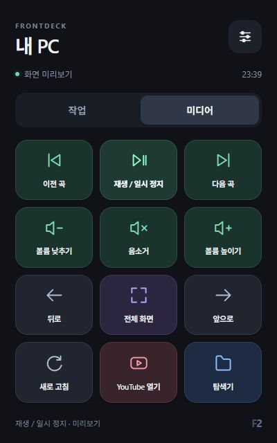

# Toss Front Custom · FrontDeck

토스 프론트 2를 일반 Android 기기 또는 PC용 터치 버튼 패널로 사용하는 작업 기록과 도구입니다.

## 현재 상태

| 대상 | 확인 결과 |
| --- | --- |
| 첫 번째 기기 | Android 13 기본 홈으로 전환. 현재 사용자에서 토스 기능 앱 22개 제거, 제조사 유틸리티 4개 사용 중지. 토스 자동 복귀 차단. 재부팅 후 유지 확인. |
| 화면 표시 | DEBUG MODE 문구 숨김. PC 연결을 끊은 화면에서 디버깅 아이콘 부재 확인. |
| 홈 화면 | Android 기본 Launcher3 홈, 전체 앱 목록, 3버튼 내비게이션 사용 가능. 오디오 출력·설정·파일·계산기 홈 바로가기 배치. |
| 공식 YouTube | Google 서명 확인 후 설치했으나 영상이 약 1~2분 후 실패. 정상 시청은 미완료. Google 구성요소는 반복 오류를 막기 위해 사용 중지. |
| Bluetooth | 첫 번째 기기에 연결된 A2DP 스피커 확인. 내장 스피커·Bluetooth 출력 전환과 실제 소리 청취 확인. |
| FrontAudio | 첫 번째 기기에 ‘오디오 출력’ 앱 설치. 음악·영상 출력 선택, 자동 선택 복원, 테스트 소리 지원. 기기 재부팅 후 PC에서 제어 재시작 필요. |
| FrontRecord | 첫 번째 기기에 ‘레코드 플레이어’ 설치. YouTube 웹의 실제 제목·썸네일·시간 표시, 재생/일시정지·위치 조절·레코드 회전 연동 확인. 웹 화면 위에 띄워 사용. 공식 앱 재생 문제는 미해결. |
| 두 번째 기기 | 사용자가 Toss Front 2와 정상 토스 화면 부팅을 확인. 케이블·PC 포트 교체와 EDL/정상 부팅 감시 후에도 USB 장치가 나타나지 않음. 백업·탈옥·앱 설치 전. |
| FrontDeck | Android APK 빌드·서명 검증 완료. Windows 연결 프로그램과 작업/미디어 버튼 화면 구현. 실물 기기 설치·제어 시험 대기. |

기본 펌웨어의 APK 원본과 하드웨어 프레임워크는 남아 있습니다. 완전한 AOSP/GSI 설치 결과로 보아서는 안 됩니다.

## 구성

- `docs/first-device.md`: 첫 번째 기기 변경과 검증 결과.
- `docs/recovery.md`: EDL 백업·디버그 설정 변경·복구 절차.
- `archive/scripts/`: 당시 사용한 조사 및 일회성 스크립트. 기기 식별 정보와 개인 경로를 치환한 참고 자료입니다.
- `tools/`: APK 빌드, 명시적으로 선택한 기기의 ADB 확인·앱 설치·PC 연결 도구.
- `frontdeck/`: Windows 앱 실행·단축키·미디어 제어용 연결 프로그램과 버튼 화면.
- `android/`: Google 서비스가 필요 없는 FrontDeck Android 앱.
- `audio-android/`: 첫 번째 기기의 오디오 출력 선택 앱과 기기 내부 제어 프로그램.
- `record-android/`: YouTube 미디어 세션과 연결하는 레코드 화면 앱.
- `youtube-web-android/`: 레코드 앱에 재생 정보를 전달하는 기존 YouTube 웹 앱의 2.0 소스.

[FrontAudio 사용·설치·재부팅 후 제어 시작 방법](docs/frontaudio.md)

[FrontRecord 사용·빌드·실물 검증 결과](docs/frontrecord.md)

## 공개 저장소에 포함하지 않는 자료

원본 UFS 전체 백업, 사용자 데이터, 펌웨어·Firehose 바이너리, 제조사 APK/역공학 산출물, Google APK, ADB 인증키, 앱 서명키와 PC 제어 토큰은 로컬에 보존합니다. 첫 번째 기기 전체 백업은 6개 UFS 영역, 총 31,977,373,696바이트이며 읽기·GPT·SHA-256 검증을 완료했습니다.

두 번째 기기는 첫 번째 기기의 백업을 재사용하지 않습니다. 연결된 기기의 식별 정보와 실제 GPT를 확인하고 해당 기기의 원본을 별도로 백업한 뒤 변경합니다.

## FrontDeck 사용

Google 서비스 없이 동작하는 전체 화면 터치 패널입니다. 작업·미디어 화면에 각각 12개 버튼을 배치했습니다. 앱 실행, 현재 PC 앱에 단축키 전송, 재생/일시 정지와 볼륨 제어를 지원합니다. PC 연결이 끊기면 버튼을 비활성화합니다.

[설치·실행·버튼 수정 방법](docs/frontdeck.md) · [두 번째 기기 진행 상태](docs/second-device.md)



Windows PC에 Python 3.11 이상이 있으면 저장소 루트에서 다음 명령으로 실제 PC 프로그램을 실행할 수 있습니다.

```powershell
python -m frontdeck.server
```

화면만 확인하는 경우에는 `--dry-run`을 추가하고 `http://127.0.0.1:38765/preview/`를 엽니다. 브라우저 미리보기에서는 실제 PC 동작이 실행되지 않습니다. 실물 연결 절차는 기기별 백업·디버그 설정·토스 자동 복귀 제거를 마친 뒤 진행합니다.

## 참고 자료

- [사용자가 제공한 토스 프론트 2 개조 글](https://gall.dcinside.com/mgallery/board/view/?id=sff&no=1722612)
- [bkerler/edl](https://github.com/bkerler/edl): 이번 작업의 읽기 클라이언트 기준 커밋 `01f84bf99a21ba4d378e17444a1dba7f7edb0c49`.
- [Android Platform Tools](https://developer.android.com/tools/releases/platform-tools)

이 저장소는 Elgato의 공식 Stream Deck 소프트웨어나 플러그인과 연동을 보장하는 프로젝트가 아닙니다. 기기의 터치 화면으로 지정한 Windows 동작을 실행하는 자체 구현입니다.
