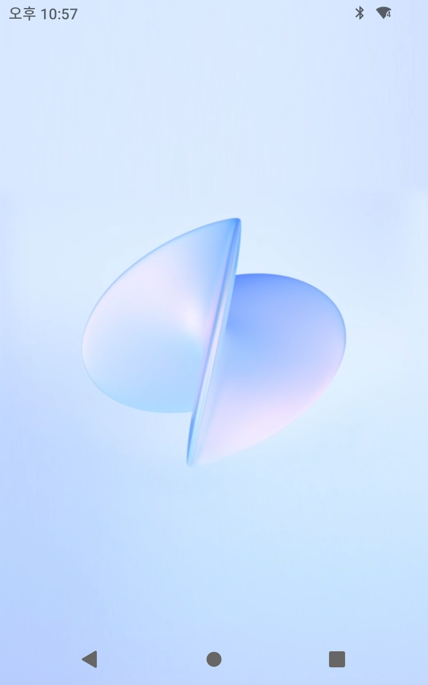
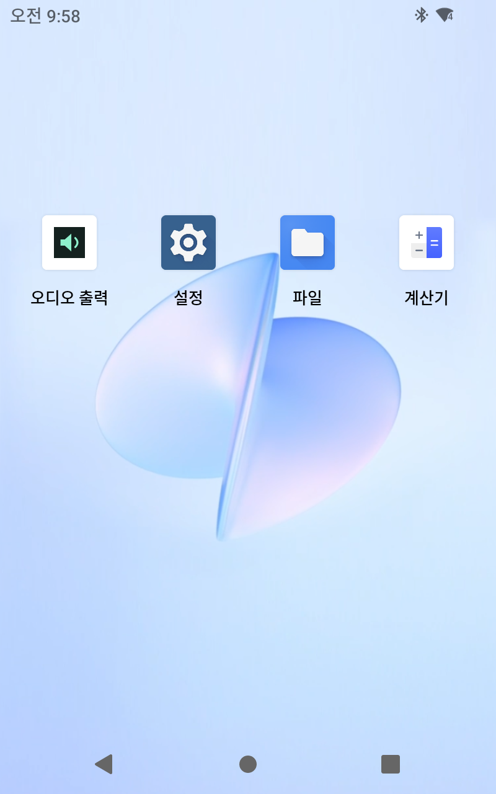

# 첫 번째 기기 작업 기록

펌웨어 변경 확인일: 2026-10-08, 홈·추가 앱 확인일: 2026-10-09 (한국 시간)

Android 13, ARM64, Toss Front 2에서 원본 UFS 6개 영역을 별도로 읽고 31,977,373,696바이트의 전체 백업을 검증했습니다. `smraw` 디버그 필드 2개, 총 34바이트를 변경한 후 Android 기본 홈으로 전환했습니다. 부팅 이미지나 다른 ROM은 플래시하지 않았습니다.

토스 본앱·결제·단말·관리·설치·업데이트·감시·Welcome 관련 22개 패키지를 user 0에서 제거했습니다. 제조사 USB 화면·공장 시험 유틸리티 4개는 사용 중지했습니다. 제조사 하드웨어 프레임워크와 시스템 APK 원본은 유지됩니다.

설정 `minicat_launcher_enabled=0`으로 자동 복귀를 차단하고 `hide_toss_wartermark=1`로 DEBUG MODE 문구를 숨겼습니다. USB 디버깅 알림은 `persist.adb.notify=0`입니다. 마지막 정상 재부팅 후 앱·프로세스·기본 홈·설정·인터넷·Bluetooth 상태 검증을 통과했습니다. PC 연결을 끊은 시점에 디버깅 알림도 없었습니다. 개발자 옵션과 Wi-Fi 디버깅 설정 자체는 유지됩니다.

## Android 홈 화면

2026-10-09에는 기본 Launcher3 홈에 오디오 출력·설정·파일·계산기 바로가기를 배치했습니다. 오디오 출력과 계산기는 홈 아이콘을 눌러 실행되는 것을 확인했고, 런처를 종료했다 다시 열어도 아이콘이 표시됐습니다. 기본 HOME은 `com.android.launcher3/.uioverrides.QuickstepLauncher`, 내비게이션은 뒤로·홈·최근 앱의 3버튼 방식입니다. `minicat_launcher_enabled=0`도 확인했습니다.

하단 원형 버튼을 누르면 홈으로 돌아갑니다. 홈에서 아래쪽을 위로 쓸어 올리면 전체 앱 목록이 열립니다. 이번 변경 후 기기 재부팅은 진행하지 않았습니다.

## 공식 YouTube의 남은 문제

YouTube 21.39.524, Google 서비스 프레임워크 13, Play 서비스 26.37.37, Play 스토어 53.4.34를 사용자가 직접 다운로드했으며 Google APK 서명과 파일 해시를 확인해 설치했습니다.

일반 앱 설치 상태에서는 Google 구성요소의 시스템 권한 부족으로 예외가 발생했습니다. RAM 기반 임시 시스템 마운트로 권한을 부여해 홈·검색·재생 시작은 확인했으나 Big Buck Bunny는 약 1분 40초, Sintel은 약 1분 53초에서 재생 오류가 발생했습니다. 새 Google 앱 데이터의 백업·초기화와 360p 선택도 정상 재생을 확보하지 못했습니다.

Play 스토어의 기기 인증 확인도 실패했지만 이것이 YouTube 오류의 직접 원인이라고 확정하지 않았습니다. Google 계정은 등록하지 않았습니다. 임시 시스템 마운트와 스테이징 파일을 제거하고 Google 구성요소 3개를 사용 중지했습니다. 마지막 정상 재부팅 후 사용 중지 상태가 유지되고 해당 프로세스 및 새 오류가 없음을 확인했습니다.

따라서 공식 YouTube는 설치됐지만 정상 사용은 미완료입니다. 이전 임시 웹 앱의 재생 결과로 공식 앱이 작동한다고 판단하지 않았습니다.

## Bluetooth

2026-10-08에는 Bluetooth/LE 기능 선언, A2DP 송신 설정, Bluetooth ON 및 A2dpService·AVRCP 서비스 실행을 확인했습니다.

2026-10-09에는 연결된 Bluetooth A2DP 스피커를 확인하고 직접 제작한 [FrontAudio · 오디오 출력](frontaudio.md)을 설치했습니다. 앱에서 내장 스피커와 Bluetooth 간 미디어 출력 경로를 바꾸고 실제 AudioTrack 경로를 확인했습니다. 사용자가 두 장치 모두 테스트 소리가 들린다고 확인했습니다. 새 기기 페어링 절차 자체는 이번 자동화 시험에 포함하지 않았습니다.

## 레코드 플레이어

2026-10-09에는 [FrontRecord · 레코드 플레이어](frontrecord.md)를 설치하고 홈 바로가기를 추가했습니다. 기존 YouTube 웹 앱은 데이터를 유지한 채 같은 서명으로 2.0으로 업데이트했습니다. 사용자가 직접 선택해 재생한 영상에서 실제 제목·썸네일·시간 표시와 재생/일시정지·위치 조절을 확인했습니다. 실제 재생 중에만 레코드가 회전하고 일시정지 때 멈추는 것도 화면 비교로 확인했습니다.

웹 앱은 다른 앱이 앞에 나오면 재생을 멈추므로, 레코드 앱 상단의 **YouTube 위에 레코드 띄우기**를 사용합니다. 이 방식으로 원래 웹 앱을 앞에 유지하며 레코드 화면에서 제어할 수 있습니다. 레코드 창을 닫아도 웹 영상 재생이 이어졌습니다. 공식 YouTube의 기존 재생 오류는 해결하지 않았으며, 이번 실물 연동 검증은 YouTube 웹에서 수행했습니다. 이번 앱 설치 후 기기 재부팅과 장시간 연속 재생 시험은 진행하지 않았습니다.

## 공개 기록의 범위

기기 일련번호, ADB 주소·인증정보, 개인 PC 경로, 사용자 데이터와 원시 로그는 이 문서 및 공개 결과 파일에서 제외했습니다. 전체 백업과 원본 작업 로그는 작업 PC에 보존돼 있습니다.
