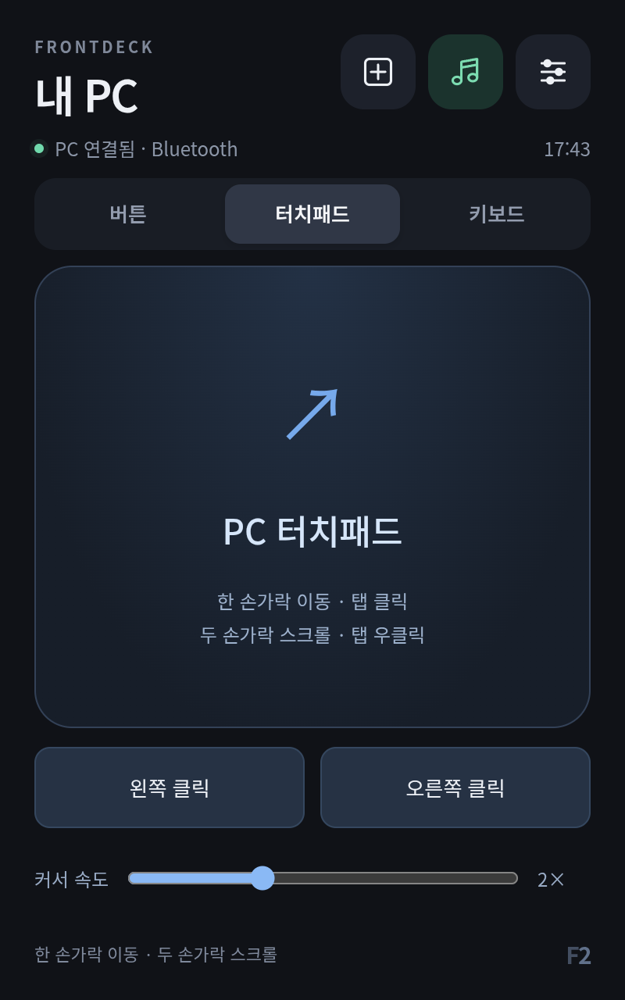

# FrontDeck 1.4.0 · Bluetooth와 PC 입력

Bluetooth에서도 PC 앱 실행·창 전환·커스텀 버튼·작업표시줄 아이콘을 사용합니다. 상단 **버튼 / 터치패드 / 키보드**에서 제어 화면을 전환합니다. 세 화면 모두 USB·Wi-Fi·Bluetooth 연결을 지원합니다. PC에서 FrontDeck 연결 프로그램을 실행해야 합니다.

## Bluetooth 연결

PC와 Android의 Bluetooth를 켜고 OS 설정에서 두 기기를 페어링합니다. 양쪽의 연결 확인 코드가 같은지 확인하고 승인합니다. 이어서 PC에서 실행합니다.

```powershell
powershell -NoProfile -File tools/Stop-FrontDeck.ps1
powershell -NoProfile -File tools/Start-FrontDeck.ps1 -Bluetooth
```

Wi-Fi도 처음 활성화하려면 `-Wireless -Bluetooth`를 함께 지정합니다. 이미 저장한 Wi-Fi 설정은 유지합니다. 이후 시작 도구는 선택한 연결 방식을 기억합니다. PC 자동 시작 등록은 하지 않습니다.

[PC 연결 창](http://127.0.0.1:38765/connect/)에서 8자리 연결 코드를 확인하고, 기기 FrontDeck 설정 → **Bluetooth 연결**에서 페어링한 PC를 선택한 뒤 코드를 입력합니다. **주변 기기** 권한을 허용합니다. 코드가 만료되면 PC 연결 창의 **새 연결 코드**로 갱신합니다.

**PC 연결됨 · Bluetooth**가 표시되면 Wi-Fi와 마이크로 USB 데이터 연결 없이 사용할 수 있습니다. C타입 전원은 유지합니다. PC와 기기의 Bluetooth, PC 연결 프로그램을 유지해야 합니다. 연결이 끊어지면 저장한 PC에 재접속하며 다른 PC나 Wi-Fi로 명령을 자동 재전송하지 않습니다.

이미 개조한 기기를 명시적으로 선택해 설치·연결할 수도 있습니다. 먼저 OS 페어링을 완료합니다.

```powershell
python tools/build_android.py --app deck
python tools/connect_deck.py --serial DEVICE_SERIAL --install --home --bluetooth
```

설치 도구는 기기·부팅 상태·APK 해시를 확인하고 앱 데이터가 유지되는 업데이트를 수행합니다. Bluetooth 옵션은 선언한 주변 기기 권한을 부여합니다. 기존 Wi-Fi 대상과 인증서 정보는 보존합니다. 기기 설정에서 Wi-Fi로 다시 연결할 수도 있습니다.

## 터치패드



- 한 손가락 이동 → 커서 이동, 짧은 탭 → 왼쪽 클릭.
- 두 손가락 이동 → 가로·세로 스크롤, 짧은 두 손가락 탭 → 오른쪽 클릭.
- 아래 **왼쪽 클릭 / 오른쪽 클릭** 버튼도 제공합니다.
- **커서 속도** 막대에서 1–4배로 조절하며 설정을 저장합니다.

움직임은 약 32ms마다 합치고 이동 요청은 하나씩 전송합니다. 연결이 느려져도 이동 요청을 무제한 쌓지 않습니다. 화면 전환·취소·앱이 숨겨지면 아직 보내지 않은 움직임을 버립니다. 클릭은 누르기와 떼기를 함께 보내며 마우스 버튼을 계속 누르는 드래그는 이번 버전에 포함하지 않습니다.

## 키보드

PC에서 입력할 창을 선택하고 화면 키를 누릅니다. **Ctrl / Alt / Shift / Win**은 선택 상태를 표시하며 다음 키와 조합합니다. 다시 누르면 선택을 해제합니다. 방향키·Space·Enter·Backspace·Delete·Tab·Home/End·Page Up/Down을 지원합니다.

**한/영** 키는 Windows의 한국어 IME 전환 키입니다. PC에 한국어 입력기가 있어야 합니다. **한글·문장 입력** 칸은 기기의 입력기로 문장을 완성한 뒤 **PC로 텍스트 보내기**를 누릅니다. Unicode 한글과 이모지를 전송하며 PC 클립보드를 바꾸지 않습니다. 한글 조합 중인 문자는 전송하지 않습니다. 입력 오류가 발생하면 일부 문자가 이미 전달됐을 수 있으므로 PC 화면을 확인한 뒤 재시도합니다.

현재 Windows의 활성 창에 입력합니다. 관리자 창·보안 화면·일부 게임의 전용 입력 처리에서는 Windows 입력 보호 때문에 동작하지 않을 수 있습니다.

## 통신과 검증

Bluetooth는 Windows RFCOMM 서버와 Android 보안 RFCOMM 소켓으로 직접 통신합니다. Windows 서버는 OS 인증·암호화를 필수로 설정하고, 앱의 5분 연결 코드·인증 토큰을 추가로 확인합니다. HID 전용 마우스 모드가 아니므로 기존 프로그램 버튼과 창 목록도 함께 제공합니다. SDP 서비스는 FrontDeck의 고유 UUID만 등록합니다. [Windows Bluetooth 소켓 옵션](https://learn.microsoft.com/en-us/windows/win32/bluetooth/bluetooth-and-setsockopt), [Android RFCOMM 연결](https://developer.android.com/develop/connectivity/bluetooth/connect-bluetooth-devices).

4바이트 길이와 JSON 본문으로 구성한 프레임은 요청 16KiB·응답 4MiB로 제한합니다. 입력 유형·범위·세션·순번을 검증하며 동일 입력을 다시 실행하지 않고 충돌하거나 오래된 순번을 거절합니다. 이동 입력은 기존 버튼 요청과 별도 한도로 처리해 오래 사용해도 버튼 요청 기록 한도를 소진하지 않습니다.

2026-10-10 첫 번째 실물 기기에 설치 APK SHA-256을 대조했습니다. OS 페어링 뒤 Bluetooth 연결을 확인했고 Wi-Fi를 끄고 USB reverse가 없는 상태에서 커서 이동·좌우 클릭·화면 키 입력을 검증했습니다. 같은 입력 처리기를 사용하는 인증된 로컬 API로 별도 Windows 테스트 창에 한글·이모지와 가로·세로 스크롤을 확인했습니다. 두 손가락 스크롤·탭, 느린 연결에서 이동 병합, 취소, 한글 조합 처리는 출하 JavaScript의 이벤트 테스트로 확인했습니다.

43개 Python 테스트와 JavaScript 입력 이벤트 테스트를 통과했습니다. Bluetooth 인증·만료·프레임 분할·잘못된 크기·UTF-16·중복 입력·실패 뒤 재실행 차단과 기존 USB/Wi-Fi·버튼 편집·아이콘 검증을 포함합니다. PC 연결 프로그램 재시작 후 재접속과 Wi-Fi에서 Bluetooth로 되돌아오는 연결도 확인했습니다. 개인 PC 주소·기기 식별값·창 제목·인증 정보가 있는 실물 증거는 Git에 넣지 않습니다.

이후 두 번째 기기에도 1.4.0을 설치하고 설치 APK 해시·기본 홈·음악 앱·PC 버튼 및 인증 정보 보존을 확인했습니다. USB reverse가 없는 상태에서 Wi-Fi 인증 요청과 실물 터치패드 화면을 확인했습니다. Bluetooth 연결 메뉴는 설치됐지만 두 번째 기기의 Bluetooth 페어링·입력은 미검증입니다. [두 번째 기기 기록](second-device.md).
