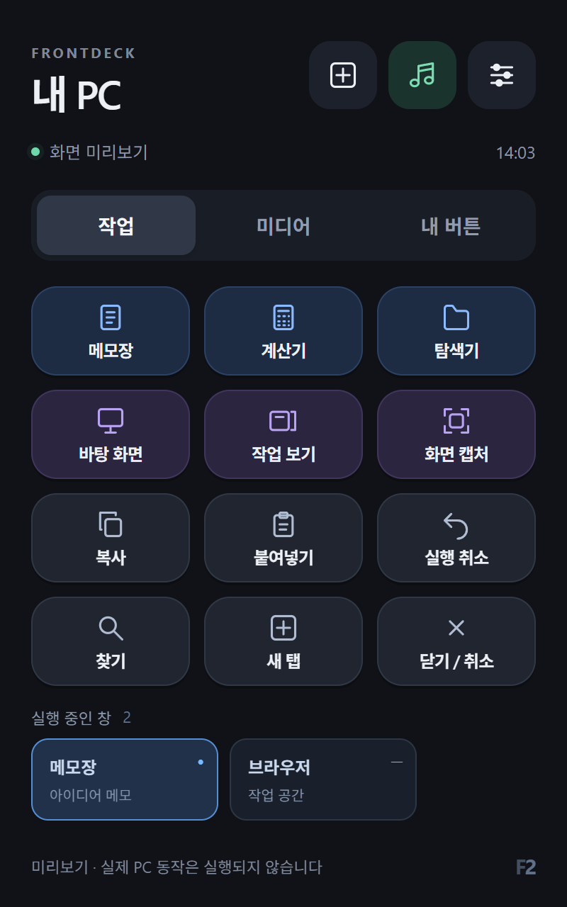

# FrontDeck 설치와 실행

PC 앱 실행·단축키·미디어 제어용 자체 터치 패널입니다. Google 서비스와 Elgato 소프트웨어가 필요하지 않습니다. 단축키는 현재 Windows에서 활성화된 앱으로 전송됩니다. 관리자 권한 앱 등 Windows 입력 보호가 적용되는 대상에서는 일부 단축키가 동작하지 않을 수 있습니다.

## 준비

- Windows와 Python 3.11 이상. USB 모드는 외부 Python 패키지가 필요 없고, Wi-Fi 모드는 `requirements-wireless.txt`를 설치합니다.
- Android Platform Tools의 ADB.
- 앱 빌드 시 JDK 17 이상, Android SDK platform `android-33`, build-tools `36.0.0`. 이번 로컬 빌드는 JDK 24로 검증함.
- Toss Front 2의 기기별 원본 백업과 디버그 설정 확인. [복구 절차](recovery.md).
- 기본 홈으로 설정하려면 토스 자동 복귀 앱 제거를 먼저 완료함. 설치 도구가 제거 대상 22개가 user 0에 남아 있으면 홈 변경을 중단함.

아래 명령은 모두 저장소 루트에서 실행합니다. `DEVICE_SERIAL`은 `adb devices -l`에서 확인한 연결 대상 하나의 식별값으로 바꿉니다. 첫 번째 기기의 식별값을 복사해서 사용하지 않습니다. 설치·연결 도구는 기본 기기를 자동 선택하지 않습니다.

## 빌드

```powershell
python tools/build_android.py
```

결과는 `dist/FrontDeck-1.3.1.apk`입니다. APK 서명과 SHA-256 검증 결과는 `build/android/verification.json`에 저장합니다. SDK가 다른 경로라면 `--sdk`를 지정합니다. `build/android/frontdeck.keystore`와 비밀번호 파일을 함께 보관해야 기존 앱을 같은 서명으로 업데이트할 수 있습니다. 빌드 파일과 서명키는 Git에서 제외합니다.

## PC 프로그램

콘솔에서 실행하면 연결 코드와 오류를 직접 볼 수 있습니다.

```powershell
Copy-Item frontdeck/config.example.json frontdeck/config.local.json
python -m frontdeck.server --config frontdeck/config.local.json
```

이미 사용자 설정 파일이 있으면 복사 단계를 건너뜁니다. 또는 다음 도구가 로컬 설정 파일을 처음 한 번 만들고 PC 프로그램을 숨겨진 창으로 실행합니다.

```powershell
powershell -NoProfile -File tools/Start-FrontDeck.ps1
```

기본 USB 모드는 `127.0.0.1:38765`에서만 연결을 받으며 방화벽 규칙이 필요하지 않습니다. 1.3.0의 [Wi-Fi 연결](frontdeck-wireless.md)은 같은 LAN의 지정된 IPv4 주소에서 TLS 포트를 추가합니다. PC를 다시 켠 뒤에는 프로그램을 다시 실행합니다. Windows 자동 시작 등록은 하지 않습니다.

콘솔 실행은 `Ctrl+C`로 종료합니다. 숨겨진 창으로 실행한 프로그램과 연결 감시는 `powershell -NoProfile -File tools/Stop-FrontDeck.ps1`로 종료할 수 있습니다. 이 저장소의 실행 파일 경로가 맞는 프로세스만 종료하며 연결 토큰과 설정은 보관합니다.

## 기기 확인·설치

PC 프로그램을 실행한 후 5분 안에 진행합니다.

```powershell
python tools/device.py --serial DEVICE_SERIAL --output runtime/device.json
python tools/connect_deck.py --serial DEVICE_SERIAL --install --home
```

기기 모델·부팅 완료·user 0과 APK SHA-256을 확인한 다음 설치합니다. `adb reverse tcp:38765 tcp:38765`로 PC에 연결하고 8자리 코드로 연결 정보를 기기 내부에 저장합니다. `--home`은 FrontDeck을 기본 홈으로 설정하며 토스 앱이 남아 있으면 진행하지 않습니다. 홈 변경 없이 먼저 앱만 시험하려면 `--home`을 생략합니다.

기기에서 ‘PC 연결됨’을 확인하고 메모장 버튼부터 시험합니다. 설치 도구의 완료 메시지만으로 연결·실제 버튼 동작·재부팅 유지가 검증된 것은 아닙니다. 기본 홈 설정 후 Android의 정상 종료 절차로 재부팅하여 홈과 토스 제거 상태가 유지되는지 확인합니다.

기기나 ADB가 다시 연결되면 reverse 포트가 초기화될 수 있습니다. 아래 감시 도구는 선택한 기기가 돌아왔을 때 FrontDeck 포트만 다시 연결합니다.

```powershell
python tools/watch_deck.py --serial DEVICE_SERIAL
```

또는 `Start-FrontDeck.ps1 -Serial DEVICE_SERIAL`로 PC 프로그램과 감시를 함께 숨겨진 창에서 실행합니다. ADB를 찾지 못하면 Python 도구에는 `--adb`, PowerShell 도구에는 `-Adb`로 실제 경로를 지정합니다.

여러 기기를 사용하는 경우 각 기기의 식별값으로 `Start-FrontDeck.ps1 -Serial DEVICE_SERIAL`을 한 번씩 실행합니다. PC 프로그램은 하나를 공유하고 USB 재연결 감시는 기기마다 유지합니다. 같은 기기로 다시 실행하면 기존 감시를 재사용합니다. `Stop-FrontDeck.ps1`은 이 저장소에서 시작한 PC 프로그램과 각 기기의 감시를 함께 종료합니다.

## 버튼 수정

1.2.0부터 기기에서 바로 편집할 수 있습니다.

1. 상단 **＋**를 눌러 이름·아이콘·색상과 버튼 모음을 선택합니다. 기본 저장 모음은 **내 버튼**입니다.
2. **PC 앱 목록에서 선택**의 검색창에서 앱 이름이나 실행 파일 이름을 검색하고 프로그램을 고릅니다. 앱 목록은 PC의 Windows AppsFolder에서 읽으며 처음 열면 잠시 걸릴 수 있습니다. 목록에 없는 프로그램은 **실행 파일 직접 등록**에서 실제 `.exe` 전체 경로와 선택적 JSON 인수 배열을 입력합니다.
3. **실행 중이면 창을 앞으로 가져오기**를 켜면 해당 실행 파일의 열린 창을 찾아 복원·전환합니다. 꺼두면 앱 실행을 요청합니다. 실행 파일을 식별하지 못하는 일부 패키지 앱은 Windows의 기존 인스턴스 처리에 따릅니다.
4. 단축키·미디어 키·HTTP/HTTPS 웹사이트도 버튼으로 등록할 수 있습니다. **저장**하면 즉시 반영되고 PC 프로그램 재시작 후에도 유지됩니다.
5. 기존 버튼을 약 0.6초 길게 누르면 편집합니다. **삭제 → 삭제 확인**은 그 버튼을 모든 모음에서 제거합니다. 같은 ID를 여러 모음에서 사용하는 버튼의 수정도 함께 반영됩니다.

모음은 최대 6개, 전체 고유 버튼은 최대 256개이며 모음마다 최대 48개를 12개씩 페이지로 표시합니다. 빈 모음에서는 바로 추가할 수 있습니다. 기기 저장 요청은 인증된 PC 프로그램이 검증하고 `frontdeck/config.local.json`을 임시 파일·원자적 교체 방식으로 저장합니다. 실패하면 기존 설정을 유지합니다. 개인 앱 경로가 들어가는 이 파일은 Git에서 제외합니다.

PC에서 설정 파일을 직접 편집할 수도 있으며 이때는 프로그램을 재시작합니다. 예제 설정을 보면서 모음 이름·순서도 바꿀 수 있습니다. 연결된 앱은 5초마다 버튼 설정 변경을 확인합니다.

1.3.1부터 PC 프로그램 버튼과 하단 작업표시줄에는 [실제 Windows 앱 아이콘](frontdeck-app-icons.md)을 표시합니다. 프로그램 아이콘을 가져오지 못하거나 단축키·미디어·웹 버튼인 경우 기존에 선택한 아이콘을 사용합니다. 버튼의 이름·색상·동작과 사용자 설정 파일은 유지합니다.

| 종류 | 설정 | 예 |
| --- | --- | --- |
| 앱 실행 | `type: launch`, `executable`, 선택적 `args` 문자열 배열 | `notepad.exe` 또는 앱 실행 파일의 절대 경로 |
| 설치된 앱 | `type: app`, `app_id`, `catalog_id`, 선택적 `executable` | 기기 앱 목록에서 선택하면 PC 프로그램이 생성함 |
| 단축키 | `type: hotkey`, `keys` 배열 | `["CTRL", "SHIFT", "S"]` |
| 미디어 | `type: media`, `key` | `PLAY_PAUSE`, `NEXT`, `PREVIOUS`, `STOP`, `MUTE`, `VOLUME_UP`, `VOLUME_DOWN` |
| 웹사이트 | `type: url`, `url` | HTTP/HTTPS 주소를 PC 기본 브라우저에서 열기 |

상대 경로의 실행 파일은 예제의 Windows 기본 앱 4개만 허용합니다. 그 외 앱은 절대 경로를 씁니다. 버튼 요청에는 등록된 동작 ID만 전달하고 셸 명령을 받지 않습니다. 기본 YouTube 버튼은 PC에서 YouTube 웹사이트를 엽니다.

## 실행 중인 창

하단 **실행 중인 창**에 제목과 앱 이름을 표시하고 약 2초마다 갱신합니다. 가로로 밀어 더 많은 창을 보고, 창을 누르면 최소화를 복원하고 PC의 맨 앞으로 가져옵니다. 파란 점은 현재 활성 창, 가로선은 최소화 상태입니다. 창이 활성화되어도 목록 순서를 유지하며 편집창이 열린 동안에는 갱신을 쉽니다.

대상은 제목이 있는 일반 최상위 창입니다. 닫힌 창은 다시 조회하여 거절하며 요청에 임의 HWND를 받지 않습니다. Windows의 입력 보호·활성 메뉴·foreground 제한 때문에 관리자 앱 등 일부 창 전환이 거절될 수 있고, 이때 성공으로 표시하지 않습니다. 창 제목과 설치된 앱 목록은 인증된 네이티브 연결에만 제공합니다. [Windows 창 전환 API](https://learn.microsoft.com/en-us/windows/win32/api/winuser/nf-winuser-setforegroundwindow).



기기의 오른쪽 위 설정 버튼에서 **Wi-Fi 연결** 또는 **USB 연결 코드 입력**, Android 설정·기본 홈 선택을 열 수 있습니다. Wi-Fi 연결은 PC 주소와 8자리 코드 입력 후 PC의 기기 확인 코드가 일치하는지 확인합니다. 연결 방식과 인증 정보는 앱 업데이트·재부팅 후에도 저장합니다. 앱은 전체 화면을 유지하고 켜져 있는 동안 화면이 꺼지지 않게 합니다. OS 자체 알림과 토스 DEBUG 문구의 제거는 별도의 기기 전환 설정에서 확인해야 합니다.

1.0.1은 기본 홈으로 실행될 때 화면을 켜고 비밀번호가 없는 잠금 화면을 닫습니다. PIN·패턴·비밀번호가 설정된 기기의 잠금은 변경하지 않으며 사용자가 직접 잠금 해제해야 합니다. [Android 화면 켜기 API](https://developer.android.com/reference/android/app/Activity#setTurnScreenOn(boolean))와 [잠금 화면 API](https://developer.android.com/reference/android/app/KeyguardManager#requestDismissKeyguard(android.app.Activity,%20android.app.KeyguardManager.KeyguardDismissCallback))를 사용합니다.

1.1.0은 상단의 음표 버튼과 설정 메뉴의 **뮤직플레이어 열기**로 기기에 설치된 레코드 플레이어를 실행합니다. PC가 연결되지 않아도 사용할 수 있습니다. 레코드 플레이어의 **홈** 또는 Android 홈 동작으로 PC 제어 패널에 돌아옵니다. 이 버튼은 기기의 앱을 열며 PC의 YouTube 버튼과 별도로 동작합니다.

## 연결 정보

8자리 연결 코드는 PC 프로그램을 시작한 뒤 5분 동안 유효합니다. 연결을 마친 앱은 별도의 임의 토큰을 앱 내부 저장소에 보관합니다. PC 상태 파일은 `%LOCALAPPDATA%/FrontDeck`에 저장합니다. 이 폴더와 기기 저장소의 인증 정보를 공개하지 않습니다.

브라우저 미리보기는 읽기 전용입니다. 실제 PC 동작 API는 연결 토큰과 허용된 Host를 확인하고 브라우저 Origin이 있는 요청은 거절합니다. 같은 요청 번호의 짧은 재전송은 60초 동안 한 번만 실행합니다. 임의 파일 읽기, PC 화면 수집, 클립보드 내용 조회, 원격 셸 기능은 구현하지 않았습니다.

## 검증

```powershell
python -m unittest discover -s tests -v
```

인증·만료·잘못된 Host/Origin·고정 명령 제한·동시 재전송·Windows 키 해제 실패 처리를 검사합니다. 실제 키 입력 테스트에는 가짜 Windows API를 사용하여 사용 중인 PC에 키를 보내지 않습니다. Android APK 빌드·서명과 브라우저의 400×640 / 800×1280 배치는 별도로 확인했습니다. 실물 두 번째 기기의 검증 상태는 [진행 기록](second-device.md)에 따릅니다.

2026-10-09 Android API 36 가상 기기에서 네이티브 페어링, 작업·미디어 버튼의 PC 요청과 시험 모드 응답, 연결 해제 시 버튼 비활성화, 재연결 복구, 앱 종료 후 홈 실행과 연결 정보 유지까지 통과했습니다. 가상 기기의 명령 전달 시험은 PC 프로그램을 `--dry-run`으로 실행하며 실제 Windows 동작을 보내지 않습니다.

2026-10-10 두 번째 실물 기기의 LineageOS 23.2 / Android 16에서 FrontDeck 1.0.1 설치 파일 해시·PC 인증 연결·기본 홈을 확인했습니다. 실물 버튼으로 Windows 메모장 실행과 PC 음량 올리기·내리기·음소거를 검증했고 원래 PC 음량을 복원했습니다. 재부팅 후 별도 화면 조작 없이 패널이 켜지고 PC 연결이 자동 복원됐습니다. 인증·명령 제한·재전송·키 해제 테스트 11개가 통과했습니다. 모든 대상 앱별 단축키 동작과 Android 13 실물에서의 FrontDeck 동작은 미확인입니다. 첫 번째 기기는 종료 상태를 유지했습니다.

페어링된 가상 기기에서 `python tools/android_smoke.py --serial emulator-5560`로 이 시험을 반복할 수 있습니다. 도구는 실물 기기 또는 PC 프로그램의 실제 동작 모드를 받으면 중단합니다.

같은 날 1.1.0의 상단 음표 버튼으로 두 번째 실물 기기에서 FrontRecord가 실행되는 것을 확인했습니다. 작업·미디어 화면과 기존 PC 연결 정보는 유지되며, APK 빌드·v2/v3 서명·설치 파일 SHA-256·JavaScript 구문 검사와 PC 프로그램 테스트 11개를 통과했습니다. 일반 재부팅 뒤 별도 깨우기·앱 시작 없이 패널과 ‘PC 연결됨’이 표시되고 음악 앱의 권한도 유지됐습니다.

같은 날 1.2.0을 앱 데이터와 페어링 정보를 보존하여 설치했습니다. 실물 기기의 ＋ 버튼에서 앱 검색·메모장 선택·저장, 길게 눌러 색상 수정·저장, 삭제 재확인과 14개 버튼의 두 번째 페이지 이동을 확인했습니다. 테스트용 버튼은 제거했습니다. 실제 메모장 창의 재사용, 가로 작업표시줄 터치로 직접 만든 최소화 테스트 창의 복원·활성화를 확인했습니다. PC 프로그램 재시작 후 버튼과 설정이 유지됐고 기본 홈·음악 앱 설치도 유지됐습니다. APK v2/v3 서명·설치 SHA-256, JavaScript 구문과 PC 테스트 24개를 통과했습니다. 모든 설치 앱의 실행과 모든 종류의 Windows 창 전환을 검증한 것은 아닙니다. 새 실물 화면에 포함된 개인 창 제목과 경로는 로컬 증거로만 보관합니다.

브라우저의 400×640·800×1280 배치와 읽기 전용 미리보기를 다시 확인했습니다. 실제 Windows 제어와 분리된 네이티브 연결 모형에서 길게 누르기가 실행 요청을 보내지 않는 것, 인수가 있는 기본 앱 버튼의 편집 시 인수 보존, 단축키 입력·저장 요청을 확인했습니다.

Windows 패키지 앱은 호스트 창의 실제 내용 프로세스와 앱 식별값을 조회하여 기존 창을 찾습니다. 설치된 계산기를 앱 목록에서 등록하여 실물 버튼으로 실행했고, 다시 누르면 같은 창이 앞으로 오는 것을 확인했습니다. 메모장·계산기 예시 버튼은 내 버튼 모음에 남겼습니다. [앱 식별 API](https://learn.microsoft.com/en-us/windows/win32/api/appmodel/nf-appmodel-getapplicationusermodelid).

같은 날 첫 번째 기기에도 LineageOS와 FrontDeck 1.2.0을 설치했습니다. 이 기기의 PC 인증 연결·기본 HOME·실제 메모장 실행·PC 음량과 음소거·정상 재부팅 후 자동 표시·연결 복원을 확인했습니다. 기존 음악 앱의 화면 설정·재생 기록·즐겨찾기를 복원했고 음표 버튼에서 음악 앱을 열었습니다. 두 기기의 감시를 각각 시작하고 서버·감시 종료와 재시작 후 기존 PC 버튼 설정 유지도 확인했습니다. [첫 번째 기기의 설치와 데이터 복원](lineage-first-device.md).
