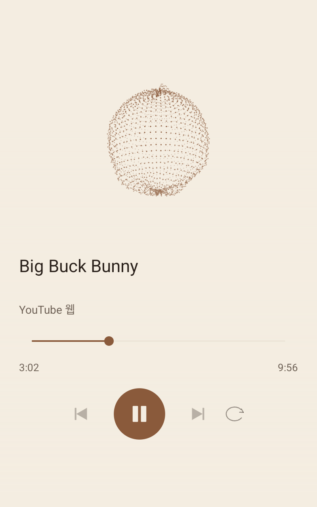

# FrontRecord · 레코드 플레이어 1.9.8

Toss Front 2의 Android 13과 LineageOS / Android 16에서 사용하는 음악 시각화 앱입니다. YouTube 웹 2.3과 연결하며, 공식 YouTube 앱 선택·실행·미디어 세션 연결은 제거했습니다. 기존 서명으로 업데이트하며 설정·기록·즐겨찾기를 유지합니다. 손 추적은 보완 중이며, 설치와 실제 동작 확인을 기기·버전별로 아래에 구분합니다.

## 사용

홈의 **레코드 플레이어 → 재생 화면 열기**를 누릅니다. 웹에서 영상을 직접 골라 재생합니다. 웹 앱의 재생을 유지하며 음악 화면이 위에 표시됩니다. 처음에 정지 상태라면 가운데 재생 버튼을 누릅니다.

상단은 **기록 아이콘 · 모래시계(재생 정지 예약) · ••• · ×** 순서입니다. FRONT RECORD 문구는 제거했습니다. 5초 동안 조작하지 않으면 상단 아이콘과 기기 볼륨 막대가 투명해집니다. 화면을 한 번 터치하면 다시 나타납니다. 숨겨진 상태의 첫 터치는 메뉴를 표시하는 데만 사용해 오작동을 막습니다. **×**는 원래 웹 화면으로 돌아가며, 영상 재생을 유지합니다. 표시 중인 알림에서도 창을 닫을 수 있습니다.

**•••** 또는 시각화 영역을 길게 눌러 화면 설정을 엽니다. 변경은 즉시 적용되고 자동 저장됩니다. 스크롤해도 설정 창의 닫기 버튼은 위에 유지됩니다.

| 설정 | 선택 |
| --- | --- |
| 시각화 | 기존 13종과 유체 구체, 입체 리본, 파형 지형, 스펙트럼 꽃, 이중 나선: 총 18종 |
| 시각화 영역 | 주요 요소가 차지하는 공간의 30–100%. 전체 캔버스의 경계로 자르지 않음 |
| 테마 | 크림, 안개, 먹, 심야, 게임보이 |
| 포인트 색 | 갈색, 테라코타, 올리브, 청록, 남색 |
| 반응 강도 | 0.25–4.20배 슬라이더. 기존 최대 1.40배의 3배까지 확장 |
| 3D 표시 필터 | 원본, 디더링, 픽셀, 픽셀 + 디더링. 게임·무대·은하·터널·새 입체 파형에 적용 |
| 시각화 색상 | 단색, 오로라, 선셋, 바다, 캔디, 직접 설정. 색조·채도·밝기로 3색 그라데이션 편집 |
| 표시 여부 | 영상 제목·채널, 재생바·시간, 재생·일시정지, 이전·다음, 반복 버튼, 기기 볼륨 각각 |
| 카메라 | 카메라 선택, 손 주변 파형·입자 변형, 한 손 핀치 상하 볼륨, 좌우 끝에서 핀치 해제해 곡 이동, 양손 상하 재생 제어, 손 윤곽선·이동선 잔상 |
| 화면·동작 | 전체 화면, 오디오 반응 카메라, 움직임 줄이기, 광고 건너뛰기 자동 누름 |

제목과 재생 제어를 숨기면 시각화에 쓸 수 있는 공간이 커집니다. 전체 화면에서는 상태바와 내비게이션바를 숨기며, 화면 가장자리에서 쓸어 올리거나 내리면 시스템 바를 일시적으로 표시할 수 있습니다. 설정 하단에는 웹 화면 보기, 오디오 출력, 기본값 복원, 오디오 분석 재연결이 있습니다.

시각화 색상은 앱의 배경·버튼 포인트 색과 별도로 저장합니다. 단색에서는 색 1을 사용하고, 직접 설정에서는 세 가지 색을 연결합니다. 레코드는 중심 라벨 테두리, 파형은 전체 선·점·막대, 3D 장면은 차체·도로·부스터·캐릭터 의상에 색상을 적용합니다. 동물의 털·악기 등은 구별이 쉽도록 고유 색을 유지합니다. 높은 감도에서는 표시 범위를 제한합니다. 기존 감도·테마·영역·기록은 업데이트 시 유지합니다.

## 게임보이 · 손 제스처 · 재생 위치

**게임보이**는 녹색 4색, 낮은 해상도와 디더링을 적용한 3D, 녹색 네이티브 파형과 주사선, 고정폭 재생 정보 글꼴로 구성합니다. 선택했던 포인트·그라데이션·3D 필터는 별도로 유지하므로 다른 테마를 선택하면 그 설정을 다시 사용합니다.

설정 맨 위 **카메라 연동**을 켜고 카메라 권한을 허용합니다. 기본값은 꺼짐입니다. 손 위치·윤곽선·잔상과 제스처 입력은 음악 화면 전체를 사용합니다. 카메라 앞 30–80cm에서 엄지와 검지를 맞대면 **핀치 · 맞댐 확인 중**, 짧게 유지하면 **조절 준비**를 표시합니다. 준비된 뒤 천천히 이동합니다. 손 위치 표시는 선택해서 끌 수 있습니다. 재생 화면을 닫으면 카메라를 해제합니다. 설정·기록·예약 창을 연 동안에는 재생 제스처를 잠시 막습니다.

- **한 손 핀치 위/아래**: 미디어 볼륨을 올리거나 내립니다. 이동량에 따라 단계적으로 변경하고 시스템 최대·최소 범위를 유지합니다. **제스처로 0%까지 내리면 일시정지하고, 제스처로 볼륨을 올리면 다시 재생합니다.** 볼륨 막대에는 자동 재생 규칙을 적용하지 않습니다.
- **좌우 끝에서 핀치 해제**: 한 손을 맞댄 채 끝으로 이동해 **왼쪽 끝 / 오른쪽 끝** 안내가 뜬 뒤 손가락을 완전히 벌립니다. 왼쪽은 이전 곡, 오른쪽은 다음 곡입니다. 끝 영역에서 120ms 이상 유지하고 손가락이 벌어진 새 분석 결과 두 개가 확인돼야 실행합니다. 이동 중이나 화면 중앙에서 손을 뗄 때는 곡을 바꾸지 않습니다. 추적 누락만으로 곡을 변경하지 않습니다. 대상이 없으면 **이전 곡 없음 / 다음 곡 없음**을 표시합니다.
- **양손 핀치 함께 위/아래**: 재생/일시정지를 명시적으로 실행합니다. 이미 정지된 음악을 아래 동작으로 다시 재생하지 않습니다. 재생 위치는 유지합니다.
- 곡 이동·양손 재생 명령 후에는 손가락을 떼고 다시 맞대야 새 명령을 받을 수 있습니다. 양손 제어가 한 손 제어보다 우선하며 한 손의 추적이 끊겨도 갑자기 볼륨이나 곡을 변경하지 않습니다.

1.7에서는 원 그리기·박수·두 번 튕기기 대신 이동 거리를 사용하는 핀치 제어로 바꿨습니다. 한 손은 320ms, 양손은 180ms의 맞댐 확인 뒤 준비됩니다. 엄지·검지 거리의 시작·유지 기준을 다르게 적용하고, 대각선 이동·위치 급변·입력 지연·추적 누락은 명령을 제한하거나 취소합니다. 1.9부터 좌우 곡 이동은 끝 영역에서의 해제로 실행합니다. 현재 버전에서는 영상 패치로 손 이동을 추측하지 않고 손 모델이 확인한 관절 좌표만 사용합니다. 기존 카메라 기능 스위치와 저장 설정은 유지합니다.

**핀치 궤적 · 잔상 표시**는 맞댄 위치부터 이동선을 이어 그리고, 손가락을 뗀 뒤 약 3초에 걸쳐 사라지게 합니다. 기본값은 켜짐이며 **손 윤곽선 표시**와 따로 설정할 수 있습니다. 이동선은 기기 메모리에만 잠깐 보관하고 저장하지 않습니다.

1.9의 모델 입력은 640×480이며, 위치 추적은 직접 읽은 휘도 영상을 작은 크기로 사용합니다. 색상 변환은 분석할 프레임에만 수행합니다. 늦게 도착한 관절 결과를 현재 영상에 맞춰 보정하며, 손바닥의 여러 위치가 동의하는 이동을 사용합니다. 1.9.1은 분석 결과 수신 시점도 반영해 방금 받은 손을 버리는 문제를 보완했습니다. 윤곽선과 파형 영향은 짧은 누락에서 잠깐 유지한 뒤 최대 420ms 내에 사라집니다. 화면 표시의 유지와 실제 재생 제어는 분리하며, 오래된 손 모양으로 새 명령을 실행하지 않습니다.

1.9.2는 한 손 추적용 모델 인스턴스와 최대 두 손 탐색용 인스턴스를 같은 분석 작업 스레드에서 번갈아 사용합니다. 한 손을 사용할 때는 두 손 탐색을 약 600ms마다 수행하고, 두 손이 잡힌 동안에는 두 손 경로를 유지합니다. 하나만 잡혀도 최대 두 손을 찾도록 설정한 모델은 손 검출기를 반복 실행하는 [MediaPipe 그래프 구조](https://github.com/google-ai-edge/mediapipe/blob/master/mediapipe/tasks/cc/vision/hand_landmarker/hand_landmarker_graph.cc)를 고려한 변경입니다. 이 구성을 사용한다고 두 손 인식 성공을 보장하지는 않습니다.

**손으로 파형 변형**은 손 주변의 파형과 도형만 변화시킵니다. 점 구체와 은하·유체 구체의 가까운 점들이 손에서 밀려나고, 링·리본·파형 지형·꽃·이중 나선에도 국소 변형을 적용합니다. 먼 부분과 실제 오디오의 기본 움직임을 유지하며 손을 치우면 변형을 복원합니다. 손으로 장면 전체를 이동·회전·확대하거나 카메라를 움직이지 않습니다. 레이싱·터널을 포함한 오디오 카메라는 손으로 변형하기 전의 오디오 값을 사용합니다.

카메라 영상은 기기 안에서 처리합니다. MediaPipe로 손 모양을 분석하고, 분석 사이에는 마지막으로 확인한 손 위치를 잠깐 유지하고 윤곽선·파형 표시를 부드럽게 보간합니다. 오래된 위치는 자동 제거하며 새 손을 임의로 만들지 않습니다. 손이 감지되지 않거나 입력이 오래 끊기면 미완성 동작을 취소합니다. 영상·손 관절 좌표를 저장하거나 전송하지 않습니다. 이 기기에서 안정적으로 사용한 일반 전면 카메라를 우선 제공하고, 일반 카메라가 있으면 합성 카메라는 선택 목록에서 제외합니다. 앱 본체와 재생 창의 카메라 소유권을 하나로 관리하며 연결 오류는 제한된 횟수만 다시 연결합니다. [SDK·모델 출처](frontrecord-third-party.md).

재생바는 드래그하는 동안 스크롤이 가로채지 않도록 하고, 손을 놓으면 실제 영상의 시간 위치를 변경합니다. 이동 중에는 선택한 위치와 안내를 표시하고 플레이어의 실제 재생 상태를 확인합니다. 라이브 영상에서 시간 기준이 다른 YouTube 내부 이동 함수 대신 영상의 시간 기준을 사용합니다. DVR 범위를 벗어난 선택은 실제 이동할 수 있는 구간으로 제한하며, 광고 중에는 위치 이동을 막습니다.

1.6의 격투는 가드·반동, 타격 링과 스파크, 타격 시 접근하는 카메라를 보강했습니다. 오케스트라는 뒤쪽 현악 파트 네 기를 추가한 아홉 리그, 열린 무대 바닥·악보대·조명, 더 큰 지휘·활·몸 동작으로 구성합니다. 게임·무대 카메라의 오디오 반응도 확대했습니다. 실제 파형·대역 변화에 연결하며, 신호가 없거나 정지하면 동작의 진행을 멈춥니다.

## 재생 정지 예약 · 기기 볼륨

기록 오른쪽 모래시계에서 **15·30·60·90분**, **직접 선택 1–180분**, **지정한 시각**, **이번 곡이 끝나면 정지**를 설정합니다. 시각이 이미 지났으면 다음 날에 예약합니다. 예약은 하나만 유지하며 새 예약이 기존 예약을 대체합니다. 예약 취소로 해제하고, 상단에서 남은 시간을 확인합니다.

예약이 끝나면 연결된 YouTube 웹의 음악 재생만 일시정지합니다. 이미 정지된 재생을 다시 시작하지 않으며, 기기 전원·화면을 끄거나 다른 앱을 실행하지 않습니다. 곡 종료 예약은 실제 비광고 영상 종료를 대상으로 하며, 앱의 한 곡·즐겨찾기 반복보다 먼저 처리합니다. 수동으로 영상을 바꾸면 이후 재생 중인 영상의 종료까지 예약을 유지합니다. 정지 예약은 한 번 실행하면 해제됩니다. 재생 세션이 없으면 새 재생을 시작하지 않습니다.

시간 예약은 앱 내부에 저장하고 Android AlarmManager로 실행합니다. 정확한 예약 권한이 있으면 exact alarm을 사용합니다. 권한이 없으면 일반 예약을 사용하며 UI에 지연 가능성과 권한 설정 버튼을 표시합니다. 부팅·앱 업데이트·시계 변경 시 저장된 시간 예약을 다시 등록합니다. 기기의 실제 전원 재부팅 후 동작은 이번 시험에서 확인하지 않았습니다. [Android 예약 문서](https://developer.android.com/develop/background-work/services/alarms).

재생 버튼 아래 스피커 슬라이더는 기기의 **미디어 볼륨**을 조절합니다. 앱을 열 때 현재 값을 읽고, 사용자가 슬라이더를 움직일 때만 시스템 볼륨을 변경합니다. 외부에서 바뀐 값도 갱신합니다. 볼륨 줄은 상단 메뉴와 함께 5초 후 투명해지고 첫 터치로 복귀하며, 막대를 드래그하는 동안에는 숨기지 않습니다. 고정 볼륨 기기에서는 슬라이더를 비활성화하며, 설정에서 볼륨 줄을 숨길 수 있습니다.

## 기록 · 즐겨찾기 · 반복

시계 모양 기록 아이콘에서 **최근 30일**과 **즐겨찾기**를 볼 수 있습니다. 실제 비광고 영상이 재생된 후 기록하며, 같은 영상은 최근 시청 시각을 갱신합니다. 항목을 누르면 다시 재생합니다. 재생 세션이 없는 새 실행 상태에서도 기록을 열어 재생할 수 있습니다.

**☆**를 누르면 즐겨찾기로 고정하고, **★**를 다시 누르면 해제합니다. 일반 기록은 마지막 재생으로부터 30일이 지나면 삭제합니다. 앱의 조회·기록 처리와 OS의 주기적 백그라운드 정리 작업에서 만료 항목을 지웁니다. OS가 작업 실행을 늦출 수 있지만, 만료 항목은 목록 조회 시 바로 제외·삭제합니다. 즐겨찾기는 사용자가 해제할 때까지 별도로 유지합니다. 최근 기록 지우기는 즐겨찾기를 지우지 않습니다.

반복 버튼은 **꺼짐 → 한 곡(1) → 즐겨찾기 목록(★) → 꺼짐** 순서로 바뀝니다. 즐겨찾기가 없으면 목록 반복은 건너뜁니다. 기록 창의 **고정 목록만 반복 재생**으로도 즐겨찾기 목록 반복을 시작합니다. 즐겨찾기로 고정한 영상들을 등록 순서대로 순환하며 마지막 영상 뒤에는 첫 영상으로 돌아갑니다. YouTube의 외부 플레이리스트 전체를 가져오는 기능은 포함하지 않습니다.

이전·다음은 즐겨찾기 목록, 웹에서 제공하는 이전·다음 버튼, 또는 사용 가능한 최근 기록을 대상으로 합니다. 설정에서 숨기지 않는 한 두 버튼을 항상 표시하고, 대상이 없거나 광고·영상 전환 중이면 흐리게 비활성화합니다. 최근 기록으로 이동할 때에는 메모리에서 이동 순서를 고정합니다. 이전 곡을 다시 재생해 기록의 맨 위로 올라오더라도 다음 버튼으로 원래 곡에 돌아갈 수 있습니다. 사용자가 웹이나 기록 창에서 다른 곡을 직접 선택하면 순서를 다시 구성합니다. 만료된 기록은 이동 목록에서도 제외합니다. 일시정지나 광고 종료는 목록 완료로 처리하지 않습니다.

기록 이동은 해당 영상을 다시 엽니다. 원래 재생 위치를 Record 앱에서 별도로 저장·복원하지 않으며, 시작 위치는 YouTube 웹의 동작에 따릅니다.

## 소리 표현 · 모션

레코드는 재생 상태에 맞춰 회전하며 260ms 가감속과 240ms 바늘 이동을 적용합니다. 판과 바늘을 별도 뷰로 구성하고 회전 변환을 사용합니다.

나머지 모드는 Android Visualizer의 출력 믹스 세션 0에서 읽은 파형·FFT로 변형합니다. 점 구체는 2,304개 점의 투영과 깊이별 밝기로 입체 표면을 표현합니다. 점 좌표·밴드 대응·그리기 버퍼를 미리 할당합니다. 구체·오로라·궤도는 갱신 간격을 낮춰 처리량을 줄였습니다. 캡처는 최대 20Hz, 표시에는 평활화를 적용합니다.

열한 3D 장면은 APK에 포함한 Three.js 0.160.1로 구성합니다. 장면을 처음 선택할 때만 WebView를 만듭니다. 외부 모델·텍스처·CDN은 사용하지 않습니다. 전체 화면을 열린 캔버스로 사용하며 제목과 제어는 그 위에 놓습니다. 사각 위젯·박스 무대·울타리는 제거했습니다. 요소의 크기·중심 위치를 설정된 영역에 맞추되, 배경과 파형은 화면 가장자리까지 이어집니다. 하단의 부드러운 배경 그라데이션으로 제어 글자가 읽히도록 합니다.

| 장면 | 소리 반응 |
| --- | --- |
| 레이싱 | 유선형 호버 차량과 파형으로 변형되는 열린 리본 도로. 실제 에너지·저음·관측된 타격 간격이 속도·부스터를 바꾸고 파형 비대칭과 음색으로 드리프트·서스펜션을 조절 |
| 격투 | 관절 인체 두 기. 낮은·높은 보컬 대역의 변화량으로 공격 주체를 선택하고, 관측된 타격 간격으로 속도, 음색·파형으로 공격 높이·훅 각도·손·킥·상대 반동을 결정 |
| 댄스 | 다면체 머리와 헤일로를 가진 빛의 관절 인형. 실제 파형·FFT·순간 변화가 팔·다리·몸·머리와 손 궤적·32점 파형 아크·스파크에 연결 |
| 오케스트라 | 올빼미 지휘, 개구리 바이올린, 사슴 첼로, 사자 트럼펫, 펭귄 피아노. 실제 대역·파형이 지휘봉·활·밸브·건반·몸 동작에 연결 |
| 입자 은하 | 1,700개 입자의 회전·팽창과 중심 구체 |
| 워프 터널 | 24개 입체 링의 이동·기울기·주파수별 크기 |
| 유체 구체 | 1,536개 입체 점. 실제 파형과 대역 에너지가 표면 반경을 변화시키며 깊이와 회전을 표현 |
| 입체 리본 | 공간에 펼친 리본 다섯 겹. 파형이 높이를, 대역이 폭·깊이를 변경 |
| 파형 지형 | 40×28 와이어 지형. 최대 20Hz로 최근 파형·스펙트럼을 메모리에서만 누적해 시간의 깊이를 표현 |
| 스펙트럼 꽃 | 입체 꽃잎 64개. 대역과 파형에 따라 꽃잎 길이·중앙 코어가 반응 |
| 이중 나선 | 입체 점 128개와 연결선. 실제 파형·대역이 나선 반경·각도를 변형 |

오디오 신호가 없거나 정지하면 장면의 이동·공격·춤을 진행하지 않습니다. 감도와 색상은 모든 장면에 공유합니다. 캐릭터는 기기에서 처리할 수 있도록 단순한 입체 형태로 제작했습니다. 3D는 최대 30fps를 목표로 제한하고 픽셀 비율을 1로 고정했으며, 프레임 지연이 없는 상태를 보장하지는 않습니다. GPU 장면을 사용할 수 없으면 안내를 표시하고 네이티브 시각화를 선택할 수 있습니다.

설정의 **3D 표시 필터**에서 원본·디더링·픽셀·픽셀 + 디더링을 선택합니다. 디더링은 4×4 Bayer 패턴과 채널별 6단계 색상, 픽셀은 약 6px 셀 크기의 저해상도 렌더 타깃과 최근접 확대를 사용합니다. 이 효과는 열한 3D 장면에 적용하며 글자·설정·재생 제어에는 적용하지 않습니다. 원본은 직접 렌더링하고, 필터는 화면 합성 패스가 하나 추가됩니다. 선택은 업데이트·앱 재실행 후에도 유지합니다.

게임·무대 네 장면과 새 입체 파형 다섯 장면은 오디오 카메라를 사용합니다. 레이싱은 추적·차체 기울기·부스터 접근, 격투는 양쪽 격투가를 포함한 원호 이동과 타격 접근, 댄스는 회전·높이·저음 접근, 오케스트라는 전체 연주자를 유지하는 완만한 원호 이동을 적용합니다. 위치는 220ms 시간상수로 평활화하며, 회전의 진행은 실제 음악 에너지의 누적값을 사용합니다. 시간을 기준으로 재생하는 카메라 투어는 없습니다. 신호가 없거나 정지하면 추가 진행을 멈추고, **오디오 반응 카메라**를 끄거나 **움직임 줄이기**를 켜면 기본 카메라 구도로 복원합니다.

정해진 순서로 좌우가 번갈아 공격하거나 시간만으로 춤추는 루프를 쓰지 않습니다. 변화량 감지와 파형·FFT의 직접 매핑을 사용하며, 회전·도로 이동의 누적값도 실제 오디오 에너지를 적분합니다. 첫 신호와 감도 변경을 공격으로 오인하지 않도록 초기화합니다. 무음 파형은 재생 상태가 켜져 있어도 움직임을 만들지 않습니다.

격투의 낮은 보컬 대역은 실제 캡처 샘플링 속도를 기준으로 80–220Hz, 높은 대역은 220–600Hz를 분석합니다. **목소리 성별이나 악기를 인식·분리하는 모델은 포함하지 않습니다.** 남성 보컬에 흔한 낮은 대역을 왼쪽에 연결하는 음색 추정이며, 같은 대역의 다른 악기도 영향을 줄 수 있습니다. 빠른 곡의 공격 속도는 실제 관측한 타격 변화 간격에 따라 달라지고, 곡의 정확한 BPM을 측정했다고 주장하지 않습니다.

마이크를 열거나 음원을 녹음·추출하지 않습니다. 분석 신호가 없으면 정지된 형태와 안내를 표시합니다. 새 오디오 경로에 연결이 늦으면 제한된 재연결을 시도하며, 계속 실패하면 설정에서 재연결할 수 있습니다. 숨겨진 창과 일시정지 상태에서는 캡처를 해제합니다. 시스템 애니메이션 끄기와 앱의 움직임 줄이기를 따릅니다.

## 광고 처리 · 웹 연동

웹 앱에서 실제로 표시된, 활성화된 공식 광고 건너뛰기 버튼만 자동으로 누릅니다. 감지에는 정해진 버튼·광고 상태 선택자를 사용하며 클릭을 제한합니다. 건너뛰기 버튼이 없는 광고는 그대로 재생합니다. 영상 탐색·속도 변경·광고 요소 삭제는 하지 않습니다. 설정으로 자동 누름을 끌 수 있습니다.

웹 페이지가 변경되면 광고 감지·건너뛰기 또는 제목 연결을 보완해야 할 수 있습니다. 실제 광고를 강제로 불러오는 시험은 하지 않았습니다. 자동 누름의 실물 성공을 모든 광고에 대해 확인한 것으로 보아서는 안 됩니다.

웹은 검증된 영상 ID와 광고 상태를 MediaSession에 전달합니다. 기록 재생은 검증된 11자 ID로 고정 YouTube 주소만 생성하며, 임의 URL을 재생 제어 입력으로 받지 않습니다. 요청한 재생·기록 재생에서는 웹의 실제 음소거 해제 버튼 또는 HTML 플레이어 음소거를 해제합니다. 시스템 볼륨은 변경하지 않습니다. 창의 테마·시스템 바 변경은 현재 영상을 새로 로드하지 않습니다.

1.9.5부터 네이티브 파형·손 윤곽선·제어 화면은 GPU의 기본 그리기 경로를 사용합니다. 전체 패널을 소프트웨어로 그린 뒤 매번 비트맵을 복사·업로드하는 경로와 100ms마다 모든 자식 뷰를 강제로 다시 그리던 코드를 제거했습니다. 3D 장면의 별도 GPU 창은 유지합니다. 과거 PC 캡처에 버튼이 빠지는 문제를 우회하던 경로였지만 1.9.5에서 사용자가 버튼이 정상으로 보인다고 확인했습니다. 모든 렌더링 지연이 사라진 것은 아닙니다.

## 데이터 · 빌드

Record 앱에 네트워크 권한은 없습니다. 요청한 재생 기록과 즐겨찾기의 ID·제목·길이·시각만 앱 내부 저장소에 보관합니다. 소리 샘플과 재생 메타데이터를 로그로 출력하지 않습니다. 공개 저장소에는 실제 기록·영상 제목·ID·기기 식별 정보·서명키·원시 로그를 포함하지 않습니다.

3D 페이지는 앱 자산의 고정 HTTPS 원점으로만 제공합니다. 파일·콘텐츠 접근과 네트워크 로드를 차단하고, JS 브리지는 설치하지 않습니다. 전달 값은 밴드·저음/고음 대역·32개 파형 샘플·RMS·감도·색상·재생 여부·배치와 최대 두 손의 제한된 위치·강도 값에 한정하며 제목·ID를 전달하지 않습니다. 값은 메모리에서만 쓰며 샘플을 저장하지 않습니다. [Android 로컬 콘텐츠 문서](https://developer.android.com/develop/ui/views/layout/webapps/load-local-content). Three.js의 버전과 MIT 라이선스는 [외부 코드 정보](frontrecord-third-party.md)에 기록했습니다.

Android SDK 33, build-tools 36.0.0, JDK, Python 3.11으로 빌드했습니다. 가벼운 모델의 빌드 시 메타데이터 처리를 위해 아래 Python 의존성이 필요합니다. 이 Python 패키지는 APK에 포함하지 않습니다.

~~~powershell
python -m pip install -r tools/vision-build-requirements.txt
python tools/build_android.py --app record
python tools/build_android.py --app youtubeweb
python tools/install_record.py --serial DEVICE_SERIAL --update-web
~~~

웹 업데이트는 처음 설치할 때 사용한 개인 서명키가 필요합니다. 실제 기기에서는 기존 서명과 데이터를 유지했습니다. 레코드 앱만 업데이트할 때는 --update-web을 제외합니다. 1.6에서는 재생 위치 이동을 보완한 웹 2.3으로 업데이트합니다. 설치 도구는 명시한 Toss Front 2의 모델·부팅 완료·사용자 0·SDK 33/36과 빌드 해시를 확인하고, 설치된 APK 해시도 다시 대조합니다. 이 앱의 미디어 접근·다른 앱 위 표시·오디오 분석·정확한 예약·알림 권한을 허용하며 기존 다른 앱의 알림 접근 설정은 유지합니다. 루트 ADB는 필요하지 않습니다. 이전 Android 13의 루트 ADB에서는 기존 Launcher3 바로가기 추가도 수행하고, 일반 ADB와 Android 16에서는 홈 데이터베이스를 수정하지 않습니다. 카메라 권한은 설치 때 부여하지 않으며 사용자가 카메라 기능을 켤 때 앱에서 요청합니다. 설치 후 Record 사용에는 PC나 root 제어 프로그램이 필요하지 않습니다. 기기 부팅 때 음악 화면을 자동으로 띄우지는 않습니다.

2026-10-10 두 번째 기기의 LineageOS 23.2 / Android 16에 FrontRecord 1.9.8과 YouTube 웹 2.3을 설치했습니다. 일반 ADB shell에서 설치·권한 설정·실제 설치 APK 해시를 확인했습니다. [공개 시험 영상](https://www.youtube.com/watch?v=YE7VzlLtp-4)의 제목·전체 길이·재생 시간이 연동됐으며 화면 버튼으로 일시정지·재생·구간 이동이 실제 영상에 반영됐습니다. 실제 출력 믹스 신호와 점 구체 반응, Three.js 레이싱의 WebGL 준비·오디오 카메라 움직임을 확인했습니다. 시험 영상은 일시정지했습니다. 재부팅 후 앱과 알림·오디오·미디어 접근·다른 앱 위 표시·정확한 예약 권한이 유지됐습니다. 카메라·손 제스처와 모든 시각화의 성능은 이 기기에서 미검증이며, 이전 첫 번째 기기의 손 추적 문제를 해결했다고 주장하지 않습니다. FrontDeck 1.1.0의 상단 음표 버튼에서 앱을 열 수 있습니다.

오프라인 검증:

~~~powershell
node tests/record_dom.cjs
python tests/run_record_motion.py
python tests/run_record_library.py
python tests/run_record_features.py
node tests/record_scenes.cjs
node tests/record_spatial.cjs
node tests/record_hand_field.cjs
python tests/run_record_navigation.py
python tests/run_record_gestures.py
node tests/record_seek.cjs
~~~

Claude Opus 5.5의 실제 응답을 [기본 설계](frontrecord-design-opus.md), [확장 설계](frontrecord-expansion-opus.md), [무대·게임 모션 재설계](frontrecord-stages-opus.md)에 보존했습니다. 1.4에서는 사용자의 직접 제작 요청에 따라 같은 모델이 게임·무대·필터 코드를 작성했습니다. [직접 제작 설계 응답](frontrecord-rebuild-opus.md)과 `game-scenes.js`, `stage-scenes.js`, `filters.js`를 통합하면서 기존 네 장면의 리그·도형을 제거했습니다. 실제 입력의 밴드 필드 이름, 공격 변화 감지 임계값, 무음 스파크 정지를 검토·보완했습니다. 1.5의 `camera-motion.js`, `wave-scenes.js`와 기록 이동 보완은 프로젝트에서 추가 구현했습니다. 설계 문서의 메시 수·화면 비율·성능은 제안 목표입니다. 실제 구현은 세로 화면, SharedPreferences 저장, 출력 믹스 분석, 네이티브 설정·기록 창을 사용합니다. 가로 배치·되돌리기 알림·제안한 모든 성능 목표를 구현·검증했다고 주장하지 않습니다.

## 이전 버전 실물 검증 · 2026-10-09

첫 번째 기기에 FrontRecord 1.5를 설치하고 기존 YouTube 웹 2.2와 연결했습니다. 번들 WebGL 로드, 게임·무대 네 장면과 새 입체 파형 다섯 장면의 실제 음악 반응, 오디오 카메라 이동 신호를 확인했습니다. 이전·다음 버튼을 눌러 이전 기록의 영상을 재생하고 원래 영상으로 돌아오는 것도 확인했습니다. 기존 테마·색상·감도·영역·표시 설정을 유지하고 시험 후 원래 시각화로 복원했습니다. 실제 출력 믹스의 신호 수신과 소리 청취는 이전 실물 검증에서 확인했습니다.

기록 표시·즐겨찾기 고정·업데이트 후 유지·기록에서 새 웹 세션 재생을 확인했습니다. 테마·시각화 변경, 영역 축소, 개별 화면 요소 숨김과 복원, 전체 화면 해제와 복원, 5초 후 메뉴 숨김과 첫 터치 복귀도 확인했습니다. 기록·설정 창을 열어도 재생을 유지했습니다.

1.3 기능 개발 중 1분 예약으로 실제 웹 재생이 일시정지된 것을 확인했습니다. 시각·곡 종료 예약의 저장과 예약 취소, 4.20배 감도 저장, 3색 편집과 그라데이션 표시, 볼륨을 한 단계 낮춘 뒤 원래 값으로 복원도 확인했습니다. 1.4 설치본에서는 기존 여섯 3D 장면의 실제 음악 반응, 네 필터 선택·표시·저장과 프로세스 재시작 후 유지, 상단 메뉴와 볼륨 줄의 5초 후 투명화·첫 터치 복귀를 확인했습니다. 곡 종료 예약을 켠 채 실제 영상 끝까지 기다리는 시험은 하지 않았습니다.

1.5에서 오프라인 검증 185개를 통과했습니다. 기존 모션·오디오 15개, 웹 메타데이터·광고·음소거·종료 사건 38개, 기록·목록 23개, 예약·감도·보컬 대역 25개, 3D 장면·필터 37개에 카메라·새 파형 실제 도형·정지·색상·모듈 문법 36개와 기록 이동 11개를 추가했습니다. 별도 Chromium 시험에서 열한 장면 렌더링, 게임·무대 카메라의 실제 위치 변화, 카메라 끄기와 정지 동작, 새 파형의 네 필터 차이를 확인했으며 콘솔 오류는 없었습니다. 최종 설치 APK와 로컬 빌드의 해시 일치 및 권한·서명을 확인했습니다. 상세 값은 [검증 결과](frontrecord-verification.json)에 기록합니다.

실제 광고 자동 건너뛰기, 여러 즐겨찾기 영상의 자연 종료 후 장시간 순환, 설치 후 기기 재부팅은 이번 실물 시험에서 확인하지 않았습니다. 짧은 프레임 측정으로 모든 상황에서 일정한 프레임 속도를 보장하지 않습니다.

## 1.6 검증

손 제스처 22개, 색상·스트라이드·회전 8개, 분석 사이의 손 위치 추적 8개, 재생 위치·DVR 10개와 기존 검증을 합해 오프라인 검증 233개를 통과했습니다. 별도 Chromium에서 열한 장면, 게임·무대 카메라, 게임보이 4색 출력, 손 입력에 따른 3D 변화, 필터와 정지 동작을 시험했고 콘솔 오류는 없었습니다.

실물에서 라이브 영상의 재생바를 이동한 뒤 실제 미디어 세션의 위치가 선택한 구간으로 바뀌고 20초 이상 유지되는 것을 확인했습니다. 기존 구현에서 발생한 시간 기준 불일치를 수정한 웹 2.3으로 시험했습니다. 무한 길이로 보고되는 모든 라이브 영상의 탐색을 확인한 것은 아닙니다.

카메라 개발 중 영상 버퍼 수명 문제에 의한 네이티브 종료, 앱 본체와 재생 창의 카메라 동시 열기, 합성 카메라 연결 불안정을 발견하고 보완했습니다. 사용자는 보완 후 손 추적 표시가 보인다고 확인했지만, 제스처 인식이 버벅인다고 보고했습니다. 이후 손 모양 분석과 카메라 입력 처리를 분리하고 분석 사이의 위치 추적을 추가했습니다. 최종 설치본에서 초기 준비 구간을 제외한 입력·추적 갱신은 약 14Hz, 손 모양 분석은 약 5–7Hz로 관측됐으며 새 앱 종료는 발견되지 않았습니다. 이는 전체 화면 렌더링의 프레임 속도나 세 제스처의 인식 성공률을 의미하지 않습니다. 원 그리기·박수·다음 곡 동작의 최종 실물 성공은 아직 사용자 확인을 받지 못했습니다.

기기 설정에서 일반 카메라 두 개와 다섯 기능 스위치를 확인했고, 게임보이 테마를 선택해 녹색 파형·주사선·고정폭 글꼴이 표시되는 것을 확인한 뒤 원래 테마로 복원했습니다. 앱 본체와 재생 창을 세 번 오가도 새 카메라 강제 해제 없이 같은 앱 프로세스와 카메라 연결을 유지했습니다.

기존 서명으로 업데이트했으며 설치 APK와 로컬 빌드의 해시, 카메라·오디오 권한, 미디어 접근, 다른 앱 위 표시와 기록 정리 작업을 확인했습니다. 실물 결과와 최종 APK 해시는 [검증 결과](frontrecord-verification.json)에 기록합니다.

## 1.7 검증과 설치 상태

핀치·네이티브 국소 변형 31개, Three.js 국소 파형·실제 입자·카메라 독립성 21개와 기존 검증을 합해 오프라인 검증 263개를 통과했습니다. 느린 입력, 방향 변경, 핀치 해제, 양손 우선 처리와 추적 누락을 합성 입력으로 시험했습니다. 별도 Chromium 시험에서 열한 장면 렌더링, 같은 오디오에서 손 입력 유무에 관계없이 같은 카메라 위치, 입자 변형과 정확한 복원, 정지와 네 필터 출력을 확인했습니다. 콘솔 오류는 없었습니다.

처음에는 Windows USB 접근이 거부됐지만 사용자가 PC에서 업데이트 도구를 직접 실행해 1.7을 설치했습니다. 이후 ADB 연결이 복구돼 설치 버전·APK 해시를 읽어 확인했습니다. 사용자는 한 손 제스처가 동작하지만 양손 인식이 불안정하다고 보고했습니다.

## 1.8–1.9.8 확인 상태

1.8은 3초 이동선 잔상과 짧은 양손 누락 복구를 추가했고 기존 데이터 보존·설치 해시를 확인했습니다. 사용자는 **잔상이 보임**을 확인했고 양손은 여전히 불안정하다고 보고했습니다.

1.9는 끝 영역 핀치 해제, 제스처 볼륨 0% 정지·증가 시 재생, 더 선명한 입력과 여러 지점 위치 추적을 추가했습니다. 1.9.1은 결과 수신 시간과 표시 누락을 보완했습니다. 두 버전 모두 설치 파일의 해시·설정·기록·즐겨찾기·예약 보존과 새 앱 종료 부재를 확인했습니다. 하지만 사용자는 1.9.1에서도 **손 윤곽선 자체가 사라졌다 나타남**을 보고했습니다. 1.9.1 로그에서 볼륨 제스처에 의한 일시정지·재생 요청을 확인했으며, 이를 실제 소리 재개나 모든 제스처의 성공률로 보고하지 않습니다. 이전·다음 곡 끝 해제와 양손 제어의 실물 성공은 아직 확인되지 않았습니다.

1.9.2는 한 손 유지·두 손 탐색 경로를 분리했습니다. 사용자가 제스처 중 윤곽선이 엉뚱한 방향으로 튄다고 보고해, 1.9.3에서는 영상 패치 기반 이동 추적을 제거했습니다. 손 모델이 확인한 위치만 제어에 사용하고 큰 위치 변화는 새 모델 관측 두 개가 일치해야 반영합니다. 화면 윤곽선·파형은 확인된 위치 사이를 부드럽게 보간합니다. 잔상, 끝 해제 곡 이동, 볼륨 재생 제어는 유지합니다.

1.9.3에서 사용자는 위치 튐과 깜빡임이 조금 줄었지만 버벅임은 남아 있다고 보고했습니다. 1.9.4는 윤곽선·잔상 위치를 화면 전체로 넓히고 네이티브·Three.js의 손 반응 좌표도 같은 화면 기준으로 정렬했습니다. 파형 표시 영역을 줄여도 손 좌표 기준은 바뀌지 않습니다. 윤곽선은 분석 사이에도 애니메이션 콜백에서 시간에 따라 보간합니다. 영상 패치로 손 위치를 추측하는 기능은 계속 제거된 상태입니다.

1.9.4에서 사용자는 전체 영역 표시는 확인했지만 버벅임은 남아 있다고 보고했습니다. 첫 번째 기기에 기존 서명으로 1.9.8을 설치했고 설치 파일과 빌드의 SHA-256 일치, 설정·최근 기록·즐겨찾기·예약 유지, 권한과 새 앱 종료 부재를 확인했습니다. 실제 인식의 부드러움·양손 제어·끝 해제 곡 이동은 별도 사용자 확인을 기다립니다. 전체 화면 렌더링의 특정 프레임 속도나 모든 조건의 인식 성공을 보장하지 않습니다.

1.9.5의 20초 측정에서 지연 프레임은 1.9.4의 83.52%에서 42.71%, 느린 비트맵 업로드는 407회에서 0회로 줄었습니다. 다만 사용자는 체감 버벅임이 비슷하다고 보고해 손 분석 경로도 보완했습니다.

1.9.8은 기본으로 **빠른 손 추적**을 사용합니다. 공식 lite 모델에 현재 Task API가 요구하는 공식 입력 정규화 정보와 라벨만 붙이며 원래 가중치는 그대로 유지합니다. 640×480 전체 카메라 영상에서 2×2 밝기를 평균해 320×240 분석 입력을 만들고 화면 전체 좌표를 유지합니다. 설정에서 이 기능을 끄면 원래 표준 모델·전체 분석 해상도로 돌아갑니다. 손가락을 잘 못 잡는 조건에서는 꺼서 비교할 수 있습니다. 모델 생성·실행 오류가 있으면 표준 모델로 자동 복귀합니다.

손이 없는 상태의 짧은 측정에서 모델 갱신은 표준 모드 약 5.8Hz에서 빠른 모드 약 8.3–8.8Hz로 늘었습니다. 손을 잡는 동안의 정확도·체감 부드러움은 아직 사용자 확인 중이며 화면 프레임 속도와 같지 않습니다. 화면 꺼짐 때 카메라 분석을 멈추고 켜짐 때 설정에 따라 재개합니다. 설치 후 깨어난 화면에서 얻은 1.9.8 렌더링 표본에는 지연이 남아 있으며, 초기 모델 준비와 재생 조건이 달라 앞선 표본과 직접 비교하지 않습니다.

최종 실물 결과는 [검증 결과](frontrecord-verification.json)에 기록합니다. 이번 수정 관련 자동 검증 150개가 통과했습니다: 핀치·네이티브 국소 변형 51, 카메라 픽셀 14, 모델 좌표 유지·재확인 15, 이동선 17, 제스처 볼륨 7, 손 표시·보간·오래된 입력 제한 14, 분석 경로 선택 9, Three.js 국소 파형·입자·카메라 독립성 23. 변경되지 않은 기존 195개 결과를 보존해 총 345개로 기록합니다. 별도 Chromium에서 열한 장면의 렌더링, 손과 무관한 오디오 카메라 경로, 국소 입자 변형·해제 복원, 정지와 네 필터를 확인했으며 콘솔 오류는 없었습니다. 합성 입력 검증은 실제 카메라의 인식 정확도를 의미하지 않습니다.
