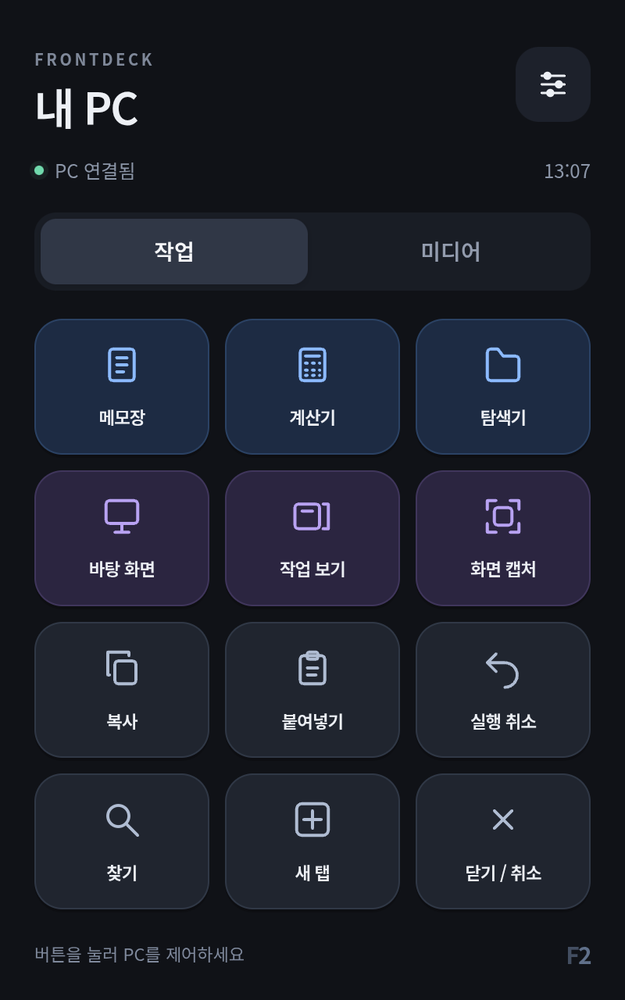

# 두 번째 Toss Front 2의 LineageOS 설치

2026-10-10 두 번째 기기 설치 당시 기록입니다. 당시 첫 번째 기기는 종료 상태를 유지했습니다. 이후 별도 사용자 요청·초기화 승인으로 [첫 번째 기기도 LineageOS와 FrontDeck으로 전환](lineage-first-device.md)했습니다. 사용자가 두 번째 기기에 비공식 LineageOS 설치, 이전 서명 부트로더 변경과 앱·설정·데이터 초기화를 명시적으로 승인했습니다. 해당 기기의 6개 UFS LUN 전체 백업과 독립 읽기·GPT CRC·SHA-256 검증을 먼저 완료했습니다.

## 이미지

공식 LineageOS 기기 목록에 Toss Front 2 전용 빌드는 없습니다. 이번 이미지는 [MisterZtr의 비공식 Treble GSI 릴리스](https://github.com/MisterZtr/LineageOS_gsi/releases/tag/v2026.05.24-lineage23.2)에서 연결된 SourceForge 파일입니다.

| 항목 | 검증한 값 |
| --- | --- |
| 파일 | `LineageOS-23.2-20260524-VANILLA-EXT4-GSI.img` |
| OS | LineageOS 23.2 / Android 16 / SDK 36 |
| 아키텍처·파일시스템 | ARM64 A/B / RAW EXT4 |
| Google 서비스 | 포함하지 않음 |
| 이미지 크기 | 2,733,260,800바이트 |
| 이미지 SHA-256 | `7b9ba62e8b48b6e40432be949ae0858a8971175c79502550e74691222d3889ff` |
| 7z SHA-256 | `4eba20225472917923c4ba6f2367ba99babcd4c847b03ddd97c315745c54c2da` |

7z 전체 다운로드·압축 CRC, RAW EXT4 헤더, 내부 빌드 속성과 AArch64 실행 파일을 확인했습니다. SHA-256은 로컬 검증값이며 배포자가 공개한 해시와 대조한 값은 아닙니다. 이 확인만으로 실물 호환성이 보장되지는 않습니다.

## 설치 통신과 변경 범위

이전 서명 ABL A 전체 읽기 대조 후 정상 OS ADB는 열리지 않았습니다. BCB `boot-fastboot` 경로로 원본 recovery fastbootd에 진입하고, Google 서명 USB 드라이버를 적용했습니다. 실제 기기에서 `product=toss_front2`, `is-userspace=yes`, `unlocked=yes`, `current-slot=a`, `snapshot-update-status=none`을 확인했습니다. 첫 번째 기기와 다른 식별값으로 각 변경 명령을 제한합니다.

5GiB super 영역에 2.55GiB 시스템 이미지를 넣기 위해 기존 OEM `product_a`·`system_ext_a` 논리 파티션과 진행 중 업데이트가 없는 상태의 남은 `*-cow` 논리 항목을 제거합니다. 이미지 내부의 `system/system_ext/etc/init/config/skip_mount.cfg`가 외부 `/product`·`/system_ext` 마운트를 제외하며, GSI 자체에 두 영역의 내용을 포함합니다. `system_a`를 이미지 크기로 확장하고 시스템을 설치합니다.

AVB 메타데이터는 두 번째 기기 원본 `vbmeta_a`에서 검증 비활성화 플래그만 0에서 3으로 바꾼 파일을 사용했습니다. 초기 부트 펌웨어·ABL B·커널·vendor_dlkm·system_dlkm·odm·하드웨어 보정값을 보존했습니다. 기존 두 번째 기기의 userdata와 초기화 관련 metadata를 지웠습니다. [Android 공식 GSI 문서](https://source.android.com/docs/core/tests/vts/gsi)의 잠금 해제·논리 파티션 설치·데이터 초기화 원칙을 참고하되 실제 기기의 레이아웃과 상태를 확인합니다.

## 첫 부팅 오류와 호환성 수정

시스템 설치 직후 LineageOS 애니메이션만 지속됐습니다. 임시 AOSP 진단 ramdisk를 적용해도 USB가 열리지 않아, EDL에서 userdata EXT4의 선택한 DropBox·ANR 파일을 읽었습니다. 반복된 watchdog 기록에서 `system_server` 주 스레드가 `AuthService.refreshVendorServices` → `ServiceManager.waitForDeclaredService`에 멈춘 것을 확인했습니다. 단순한 초기 부팅 지연이나 메모리 부족으로 추정하지 않고 실제 오류 기록을 근거로 수정했습니다.

원본 vendor의 `qfp-daemon.xml`이 응답하지 않는 `android.hardware.biometrics.fingerprint.IFingerprint/default`를 선언하고 있습니다. 배포자의 [생체인식 서비스 초기화 패치](https://github.com/MisterZtr/LineageOS_gsi/blob/lineage-23.2/patches/trebledroid/platform_frameworks_base/0044-Bunch-of-FOD-stuff-commonize-refreshing-the-services.patch)가 부팅 주 스레드에서 해당 서비스 등록을 기다리는 경로와 일치했습니다.

두 번째 기기 원본 vendor 이미지에서 다음 세 파일의 내용 441바이트만 변경했습니다. 파일 크기·EXT4 메타데이터·권한·SELinux 레이블과 나머지 바이트는 동일하며 `e2fsck -f -n`의 다섯 단계 검사를 통과했습니다.

| 파일 | 변경 |
| --- | --- |
| `/vendor/etc/vintf/manifest/qfp-daemon.xml` | 사용하지 않는 지문인식 HAL 선언만 제거해 부팅 대기를 해소 |
| `/vendor/bin/init.qcom.usb.sh` | 초기 USB 조합을 제조사 진단 복합 채널에서 `adb`로 변경 |
| `/vendor/build.prop` | 제조사 gadget HAL 대신 기존 vendor init의 configfs 경로 사용 |

수정 이미지의 6개 sparse 전송이 모두 성공했습니다. 임시 진단 `vendor_boot_a`는 이 기기의 원본 이미지로 복원한 뒤 재부팅했습니다. 실물에서 지문인식 선언의 SHA-256을 준비 이미지와 대조했습니다. USB 스크립트와 build.prop는 원본 권한을 유지해 일반 ADB shell에서 읽을 수 없으므로 세 파일 모두의 실물 해시를 확인했다고 주장하지 않습니다. 실제 USB는 `sys.usb.config=adb`, `sys.usb.configfs=1`로 정상 연결됐습니다.

임시 인증 해제 설정은 제거됐으며 `ro.adb.secure=1`, `ro.debuggable=0`, `ro.force.debuggable=0`, shell UID 2000을 확인했습니다. 잠금 해제와 AVB 검증 비활성화는 GSI 설치 상태로 유지됩니다.

## 결과

`system_a` 확장, 20개 sparse 시스템 전송과 userdata·metadata 초기화가 모두 성공했습니다. 호환성 수정 후 한국어 초기 설정과 홈 화면 진입을 사용자가 확인했습니다. 실물에서 LineageOS 23.2·Android 16·SDK 36, `sys.boot_completed=1`, 초기 설정 완료, Wi-Fi DNS·인터넷 응답, USB 연결을 확인했고 정상 재부팅 후에도 홈과 연결이 유지됐습니다.

FrontDeck을 설치·PC와 인증 연결하고 기본 홈으로 설정했습니다. 실물 화면에서 메모장 버튼을 눌러 Windows 메모장 실행을 확인했으며 볼륨 올리기·내리기·음소거 버튼의 실제 PC 음량 변화를 Core Audio로 읽어 검증했습니다. 시험 후 PC의 원래 음량·음소거 상태를 복원했습니다. 인증·명령 제한·재전송·키 해제 테스트 11개도 통과했습니다.

첫 FrontDeck 재부팅 시험에서는 비밀번호 없는 잠금 화면과 절전 상태가 패널을 가렸습니다. 1.0.1에 앱 실행 시 화면 켜기·비보안 잠금 화면 닫기를 추가했습니다. 설치된 APK의 SHA-256이 빌드 파일과 일치하며, 다시 재부팅한 뒤 별도 깨우기·잠금 해제·앱 시작 명령 없이 `mWakefulness=Awake`, 기본 홈과 최상위 앱 `dev.tossfront.deck/.DeckActivity`, 화면의 ‘PC 연결됨’을 확인했습니다. PC에서 실행 중인 감시가 ADB reverse 연결을 자동 복원했습니다. PIN·패턴·비밀번호가 있는 기기는 사용자가 잠금을 해제해야 합니다.

이후 FrontDeck 1.1.0과 FrontRecord 1.9.8·YouTube 웹 2.3을 설치했습니다. 상단 음표 버튼으로 뮤직플레이어를 열고 홈 동작으로 PC 제어 패널에 돌아올 수 있습니다. 실제 제목·재생 시간·일시정지·재생·구간 이동과 오디오 파형, Three.js 표시를 검증했습니다. 1.1.0 재부팅 후 패널·PC 연결과 음악 앱 권한 유지도 확인했습니다. [음악 앱 검증과 사용법](frontrecord.md).

기기 자체 오디오·카메라·Bluetooth와 모든 단축키의 대상 앱별 동작은 아직 실물 검증 전입니다. 제조사 WFD/HDCP 서비스 오류 기록이 남아 무선 화면 전송의 정상 동작을 보장하지 않습니다. 펌웨어 이미지·기기 식별값·개인 데이터·로컬 분석 산출물은 저장소에 포함하지 않습니다.

이후 FrontDeck 1.2.0을 앱 데이터 보존 방식으로 업데이트했습니다. 기기 내 커스텀 버튼 편집과 실제 PC 창 작업표시줄을 추가했으며 실물 생성·편집·삭제·페이지 이동, 기존 창 재사용과 최소화 복원·활성화, PC 프로그램 재시작 뒤 설정 유지까지 확인했습니다. [FrontDeck 1.2.0 사용법과 검증](frontdeck.md).
