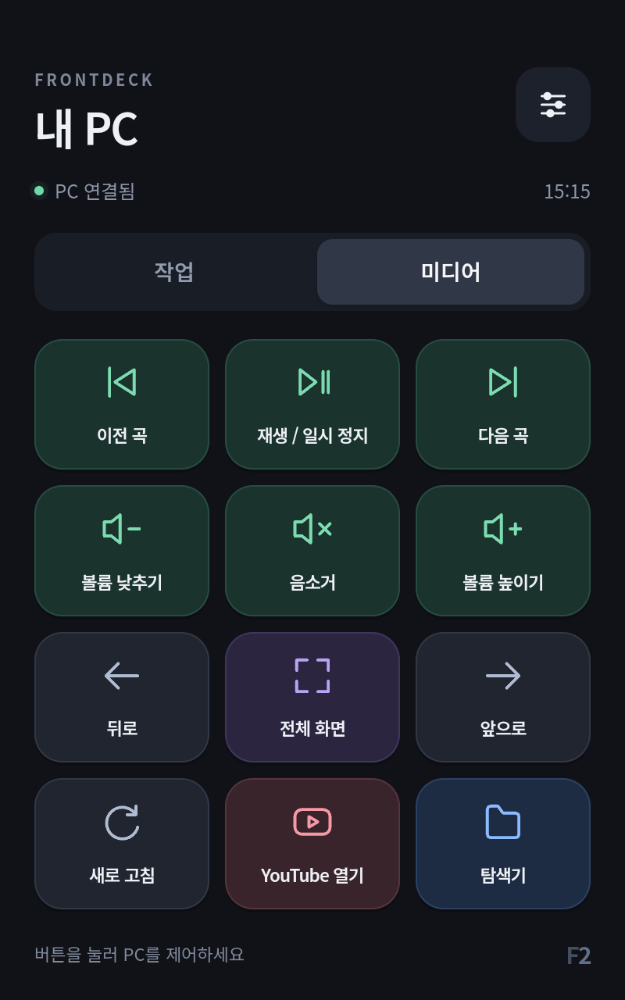

# 두 번째 기기 진행 기록

USB·백업·펌웨어·실물 앱 검증은 2026-10-10 기준입니다. 사용자 요청은 Toss Front 2를 토스 자동 복귀와 디버그 표시가 없는 PC 제어 패널로 전환하는 것입니다. 버튼 용도는 이 PC의 앱 실행·단축키·미디어 제어입니다. 현재 LineageOS 23.2 / Android 16과 FrontDeck 1.0.1 설치를 완료했으며 재부팅 후 패널 자동 실행과 PC 연결 복원을 확인했습니다. 아래 연결 조사와 변경 기록을 시간 순서로 보존합니다.

## 연결 상태

2026-10-10에는 Qualcomm `05C6:9008` 장치가 처음 감지됐습니다. WinUSB 드라이버와 Windows 오류 코드 0을 확인했고, Sahara/Firehose 실제 통신 및 RAM 로더 실행에 성공했습니다. 첫 번째 기기와 다른 칩 일련번호를 확인한 뒤 별도 백업 폴더를 사용했습니다. PHISON 32GB UFS, 4096바이트 섹터, 6개 LUN의 실제 GPT와 기본 헤더·항목 CRC를 읽었습니다. 저장 용량 합계는 31,977,373,696바이트이며 파티션은 99개였습니다.

Windows 상위 장치 조회에서 초기 연결은 USB 허브 두 개를 거치는 것으로 확인됐습니다. 사용자가 PC 뒤쪽 포트로 변경한 뒤 USB 루트 허브와 메인보드 컨트롤러에 직접 연결된 경로를 확인했습니다. 이 경로에서 완전 전원 분리·EDL 재진입 후 대용량 읽기가 안정됐습니다. Zadig 재설치는 하지 않았습니다.

6개 LUN 전체, 총 31,977,373,696바이트의 백업을 완료했습니다. 16MiB 단위 읽기 명령의 데이터 크기·최종 ACK를 확인하고, 기본·백업 GPT CRC와 각 전체 이미지의 SHA-256을 검증했습니다. `smraw`, `boot_a`, `vendor_boot_a` 독립 읽기가 전체 이미지의 같은 영역과 일치했습니다. 초기 허브 경로에서 확보한 LUN 4의 512MiB도 직접 연결에서 다시 읽어 바이트 단위 및 128MiB 조각별 해시로 일치함을 확인했습니다. 오류·불완전 파일은 완료 백업에 포함하지 않습니다.

해당 기기의 실제 GPT로 `smraw` 위치를 확인한 뒤 첫 섹터 4096바이트만 썼습니다. `SYSDEBUGMODE=true`와 `APPDEBUGMODE=true`의 총 34바이트가 바뀌었고, 새로운 읽기에서 섹터 전체가 준비한 값과 일치함을 확인했습니다. 재부팅 명령 전에도 다시 읽어 확인했습니다. 사용자 데이터는 지우지 않았습니다.

이 단계의 정상 전원 재연결 후 사용자가 토스 화면 부팅과 디버그 표시 부재를 확인했습니다. 당시 Windows 전체 USB 조회와 ADB 목록에는 이 기기가 나타나지 않았고 FrontDeck 설치와 토스 앱 제거는 하지 않았습니다. 첫 번째 기기는 사용자 요청에 따라 종료 상태를 유지합니다.

## 디버그 적용이 막힌 원인

두 번째 기기의 원본에서 OS 빌드 475, 버전 1.609.5를 확인했습니다. ABL A/B를 오프라인으로 분석한 결과, `smraw`의 `0x300`·`0x400` 필드를 읽은 직후 두 디버그 필드를 `false`로 덮어쓰고 이후 값을 해석하는 코드가 두 슬롯 모두에 있습니다. 첫 번째 기기의 원본 ABL에는 이 덮어쓰기 코드가 없습니다. 따라서 첫 번째 기기에서 성공한 `smraw` 변경만으로 이 기기의 정상 ADB가 열릴 것으로 가정할 수 없습니다.

이전의 수정하지 않은 서명 ABL 후보와 두 번째 기기의 현재 ABL을 비교했습니다. 후보의 RSA-PSS 서명·인증서 체인·ELF 데이터 해시를 검증했고, 루트 인증서와 서명 메타데이터가 일치합니다. 두 기기의 원본 XBL A/B도 바이트 단위로 같습니다. 이 검증은 실제 기기에서의 부팅 호환성을 보장하지 않습니다.

후보 `abl_a` 1MiB와 두 번째 기기 원본 `abl_a` 복구 파일을 로컬에 준비했습니다. 후보 출처는 같은 모델 첫 번째 기기의 원본 펌웨어 영역이며, 첫 번째 기기의 식별값·설정·사용자 데이터는 복사하지 않습니다. 사용자가 비공식 LineageOS 설치, 부트로더 변경과 초기화를 명시적으로 승인했습니다. 새 기기 식별·GPT·원본 ABL·디버그 섹터 대조 후 `abl_a`에 적용했고 별도 읽기에서 1MiB 전체가 후보와 일치했습니다. 쓰기 클라이언트의 최종 ACK 해석은 실패했지만 독립 읽기는 ACK와 전체 바이트 일치를 확인했습니다. `abl_b`와 초기 부트 펌웨어는 변경하지 않았습니다.

전원 재연결 후에도 정상 OS ADB와 디버그 표시가 열리지 않았습니다. EDL로 다시 읽어 ABL 후보와 디버그 섹터가 그대로 유지되고 슬롯 A GPT 플래그가 변하지 않았음을 확인했습니다. 이후 원본 `misc`의 다른 값을 보존하며 BCB 명령만 `boot-fastboot`로 바꿔 stock recovery fastbootd로 진입했습니다. 이 명령은 프로그래밍 ACK를 받았지만 같은 프로세스가 USB를 잡고 있어 별도 읽기가 실패했고, 확인 전에 재부팅한 검증 순서 오류가 있었습니다. 실제 fastbootd 진입과 식별값·모델·슬롯 A·잠금 해제·snapshot 상태 `none`을 확인했습니다. 이후 작업은 각 명령 전 대상 식별과 모드·슬롯·잠금·업데이트 상태를 다시 확인합니다.

fastboot USB 장치의 Windows 오류 코드 28은 Google 공식 USB 드라이버 ZIP과 Google LLC 서명이 유효한 카탈로그를 확인하고 변경하지 않은 INF를 설치해 해결했습니다. EDL 드라이버와 Zadig 설정은 바꾸지 않았습니다. [LineageOS 이미지와 현재 설치 결과](lineage-second-device.md)를 별도로 기록합니다.

부팅 불가 시 EDL로 돌아가 두 번째 기기의 원본 `abl_a`만 복원하는 절차를 준비했습니다. 실제 원복 시험은 아직 하지 않았습니다. 펌웨어 바이너리와 분석 산출물은 공개 저장소에 올리지 않습니다.

아래 내용은 2026-10-08~09의 이전 연결 조사입니다.

사용자가 모델을 Toss Front 2로 확인했습니다. EDL 진입 시도 후 화면은 검게 유지됐지만 Windows에 Qualcomm 9008 또는 새 USB 장치가 나타나지 않았습니다. 다른 데이터 케이블과 PC 본체의 다른 포트로 변경한 뒤에도 동일했습니다.

이어서 EDL 버튼 없이 정상 부팅했고 사용자가 토스 화면을 확인했습니다. Windows USB 감시 중 Qualcomm/Android/문제가 있는 USB 장치의 추가 기록이 없었으며 ADB 목록에도 실물 기기가 나타나지 않았습니다. 정상 부팅만으로 USB 데이터 통신이 확인된 것은 아닙니다. 검은 화면만으로도 EDL 연결 완료를 판단할 수 없습니다.

당시에는 기기에서 모델·저장장치·GPT를 직접 읽지 못했습니다. 두 번째 기기의 백업, 파티션 변경, 토스 앱 제거, FrontDeck 설치는 수행하지 않았습니다. 첫 번째 기기의 백업과 식별값은 재사용하지 않았습니다.

2026-10-09 첫 번째 개조 기기를 다시 연결한 비교에서 Windows USB와 ADB가 정상 인식됐습니다. 읽기 전용 조회로 `toss_front2`, Android SDK 33, 부팅 완료를 확인했습니다. 첫 번째 기기의 설정은 변경하지 않았습니다. 같은 케이블·PC 포트를 사용한 비교라면 PC 데이터 연결 경로는 작동하는 것으로 볼 수 있으며, 두 번째 기기의 데이터 포트 접촉과 EDL 버튼·진입 상태를 확인해야 합니다. 이 결과만으로 두 번째 기기의 하드웨어 고장을 단정하지 않습니다.

## 준비한 소프트웨어

- Google 서비스가 필요 없는 FrontDeck Android 앱. 로컬 APK 빌드 및 v2/v3 서명 검증 완료.
- 전체 화면, 켜진 동안 화면 유지, 기본 홈 등록 가능, 작업·미디어 프로필과 큰 터치 버튼.
- Python 표준 라이브러리로 만든 Windows 연결 프로그램. 앱 실행·단축키·미디어 키와 로컬 설정 파일.
- 명시적으로 선택한 ADB 기기의 모델·부팅·현재 사용자 확인, 검증 APK 설치, 포트 연결·페어링·홈 설정 도구.
- 재연결 때 FrontDeck 포트만 복원하는 ADB 감시 도구.
- 인증·명령 제한·재전송·포트 중복 방지·키 해제 검증 테스트 11개 통과. JavaScript 구문 검사 통과.
- 브라우저에서 400×640 및 800×1280 배치와 읽기 전용 버튼 반응 확인. 미리보기 화면은 실물 기기 설치 증거가 아님.
- 2026-10-09 Android API 36 가상 기기에서 네이티브 페어링, 작업·미디어 버튼 요청과 시험 모드 응답, 연결 해제/복구, 종료 후 홈 실행과 연결 정보 유지 확인. 이 가상 기기 시험은 실제 Windows 키 입력을 하지 않았음.

## 실물 설치 결과

LineageOS 23.2 / Android 16 시스템 설치와 초기화 후 원본 vendor의 지문 HAL 대기 및 USB 설정을 수정했습니다. 실제 초기 설정·홈·터치·USB·Wi-Fi와 정상 재부팅을 확인했습니다. 인증되는 ADB shell을 사용하며 루트 권한을 활성화하지 않았습니다. 임시 진단 vendor_boot는 원본으로 복원했습니다.

FrontDeck 1.0.1 설치·설치 파일 해시·PC 인증 연결·기본 홈을 확인했습니다. 실물 버튼으로 Windows 메모장 실행과 PC 음량 올리기·내리기·음소거를 검증하고 PC 원래 음량을 복원했습니다. 재부팅 후 별도 깨우기·잠금 해제·앱 시작 명령 없이 화면이 켜지고 패널과 PC 연결이 자동 복원됐습니다. 카메라·Bluetooth·기기 자체 오디오·대상 앱별 단축키와 무선 화면 전송은 검증 전입니다. WFD/HDCP 서비스 오류가 남아 있습니다. 자세한 변경과 제한은 [설치 기록](lineage-second-device.md)에 적었습니다.

이후 사용자 요청으로 FrontRecord 1.9.8과 YouTube 웹 2.3을 설치하고 FrontDeck을 1.1.0으로 업데이트했습니다. 기기에 설치된 뮤직플레이어를 여는 상단 음표 버튼과 설정 메뉴를 추가했습니다. 일반 ADB shell에서 세 앱의 설치 해시·음악 앱 권한을 확인했고, 실제 YouTube 제목·재생 시간·일시정지·재생·구간 이동과 점 구체의 실제 오디오 반응, Three.js 레이싱의 WebGL·오디오 카메라 움직임을 검증했습니다. 시험 영상은 정지했고 카메라 기능은 꺼진 상태를 유지했습니다. 재부팅 후 FrontDeck 자동 표시·PC 연결 복원과 음악 앱 권한 유지도 확인했습니다. 첫 번째 기기를 켜거나 변경하지 않았습니다.
